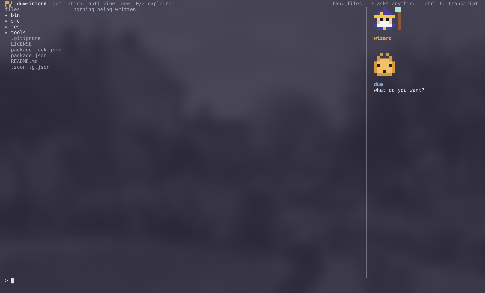

# dum-intern

One intern. It builds what you can explain.



It interrogates me before it builds anything. Nothing gets written until I approve a spec made out of my own answers.


### anti-vibe / understand everything

```sh
dum "print hello world in rust"       # anti-vibe (default)
dum -u "print hello world in rust"    # understand everything
```

The mode sets how much I have to explain myself.

anti-vibe means I need to understand what and why, not how. "Print hello world in rust" is a concept I already have, so it asks nothing and builds it. It only stops me when the intent has a hole.

understand-everything means the same request is full of holes. What `println!` is, why it ends in `!`, what `fn main` returns.

anti-vibe is the default. A tool that interrogates me over a one-line change is one I turn off in a week.


### The intern asks, the wizard tells

Two voices, nothing crosses. Questions come from the intern, statements come from the wizard.

The wizard only fires on an answer I already gave. If it commented on a pending question it would just be answering it for me.


### The wizard talks without being asked

```
  > another worker should pick it back up after a while if the first one dies

     │ 🧙 that's a visibility timeout - the mechanism SQS and most
     │    job queues use for exactly this failure case.
```

When something I said has context attached, it mentions it. The real name for what I described, what does it in industry, the standard implementation.

I built it as a critic first. It was worse. Criticism makes you stop and deal with it, so it can only fire rarely. Trivia is free to ignore, so it can talk more often. It also teaches me things I didn't know to ask about.

Naming things is the most useful thing it does. There's no search in here. The wizard hands me the search term and I go look it up.


### It doesn't know what the intern asked

It gets what I'm building and the sentence I just said. Not the question.

The question was in there at first. I described a worker reclaiming a dead worker's job, which is a lease, and it called it a dead letter queue in 2 runs out of 5. The question had mentioned retries and failures and it answered that instead. Prompting it not to didn't work. Removing the question did.

Side effect: an answer like "yes" or "postgres" now gives it nothing to grab, so it stays quiet.


### Sonnet, not Haiku

Haiku got names wrong. Sonnet got that same lease case right 5 out of 5. Same wall time, since the latency is the round trip and not the model.

The name is the whole product. A wrong one is worse than nothing, I'd repeat it in an interview.

Thinking off, effort medium, no settings files. Defaults took ~25s per quip, slower than me typing the next answer, so quips showed up after I'd moved on. Now ~1.5s. Skipping settings also keeps my CLAUDE.md from overwriting the wizard's personality.


### idk

Not knowing the answer and not having the concept are different. I type `idk` and the wizard explains the concept, why it exists, and what teams argue about with it. Then it hands the question back without answering it.

I declare it. Nothing infers it.


### Enforced in code, not in the prompt

Mutating tools are denied until I approve the spec. v1 asked for this in the system prompt. On the first real run the intern skipped it, wrote two files, and printed "nothing was built".

Paths get checked on the way through too. `cwd` doesn't confine the agent - it wrote to `$HOME` while `cwd` was a scratch dir.

Held and refused tool calls render differently from ones that ran.


### Not done

Quips render inline, not in a real second pane. They're set in and narrower so I can tell the voices apart. Every quip gets written to `.dum/wizard.jsonl`, so the pane is a reader over that file.

Nothing checks the build against the spec afterwards.

Wizard lessons disappear at the end of the session.


### Running it

Node 22.6+ and the `claude` CLI logged in. No build step, no API key.

```sh
npm install
npm link      # puts `dum` on your PATH
cd some-repo
dum
```
