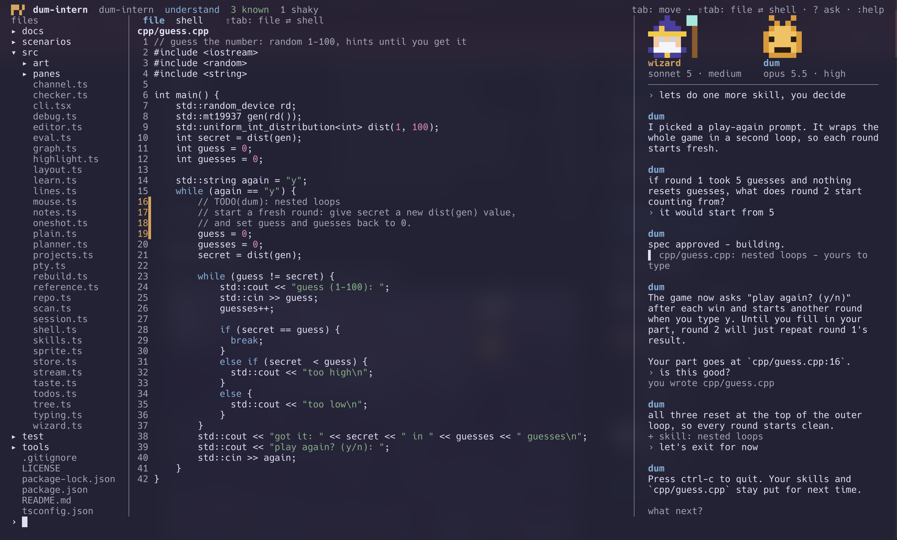

# dum-intern

[](https://github.com/hub-ry/dum-intern/actions/workflows/ci.yml)

My custom agentic environment with a tighter development leash: the AI works at the edge of what I can do, and code decides where that edge is.



The goal isn't coding without an LLM. It's being able to take the LLM away and still make progress: think of an idea, see its architecture, start typing, and ask a precise question when I get stuck. Vibe coding skips the middle of that. Refusing AI throws away the speed. dum sits between them. It writes what I've shown I can write, uses libraries I can say the purpose of, and leaves the rest to me as small holes or three-minute courses. As I learn, the edge moves and the AI does more.

The bet: friction belongs at decisions, not at the keyboard. No quizzes, no modes. Before AI writes a project, I answer one question about its core. When a plan leans on a library I haven't seen, it asks what it's for, in a line. Everything else is ordinary coding in my own repo.

**It needs Claude Code.** dum runs on the Claude Code bundled with the Agent SDK, which signs in with your `claude` CLI login, so the CLI has to be installed and logged in before `dum` does anything. Every plan, course and check runs on that account. There's no API key to paste and no offline mode.


### Quickstart

Node 22.6+ and the `claude` CLI, installed and logged in: `claude auth login`, and `claude auth status` to check. No build step.

```sh
npm install
npm link        # puts `dum` on your PATH
cd some-repo    # dum works inside a git repo
dum
```

In a repo with code in it, the first screen is what AI may do there. An empty tree says how to fill it. `dum --help` lists the commands, and `:help` inside dum lists the rest.


### Try changes with a separate practice tree

Run this checkout in a fresh Git repo with a separate skill tree:

```sh
npm run practice
```

It prints the workspace and skill-note paths. They stay on disk after you exit, so you can inspect what happened. It starts with an empty tree and no web link. Your real projects and `~/.dum` stay untouched. Inside dum, add only skills you can already write yourself, or start with `course printing in c++`.

For tree commands without a model call:

```sh
export DUM_HOME="$(mktemp -d)"
node --import tsx src/cli.tsx --add "printing, variables, arithmetic, functions" --in c++
node --import tsx src/cli.tsx --skills
```

`unset DUM_HOME` returns those commands to your normal tree.


### The loop

1. **Ask.** "a python cli that watches a folder and backs up files that changed".
2. **One decision.** "When a file event fires, how would you decide whether that file actually needs a fresh backup copy?" A real answer records recognition. If I have already built that skill, it records apply. Explaining an approach never proves I can implement it.
3. **The plan.** The intern names the skills the code rests on. dum sorts them, in code:

```
  backup.py: every file in ./watched whose contents differ from its copy in ./backup gets copied over

  YOU ALREADY KNOW - DUM WRITES
  - printing (python)
  - files (python)
  - for loops (python)

  AI MAY IMPLEMENT
  - hashlib: a tool you recognize
  - pathlib: a tool you recognize

  YOU MUST IMPLEMENT
  - change detection (python): decide if a file differs from its backup copy by comparing hashes
```

   Before I answered, both libraries sat under "what's it for?". One line ("hashlib turns the bytes into a fingerprint so I can tell if contents changed") moved them up. `course x` unlocks a concept right there. `y` builds.

4. **Fill the gaps.** dum writes its blocks in front of me. What's mine is a `TODO(dum)` hole. I type it in any editor, save, and say `done`.

That run is real, in a fresh repo with fourteen Python basics on the tree. It ended with a working backup script where the one function that mattered was mine.

A plan carries at most four pieces that aren't AI's to write, because working memory holds [about four chunks](https://philpapers.org/rec/COWTMN) (Cowan, 2001). Past that, dum refuses the plan and the intern offers a first rung instead. With only printing unlocked, "write a recursive fibonacci function for me" came back as an iterative fibonacci on variables and arithmetic.


### Three levels, two kinds

Every skill on the tree has a level:

| Level | Means | How it's shown |
| :--- | :--- | :--- |
| recognize | I can say what it is and what it's for | a one-line answer |
| build | I can write it myself | typing a hole, or passing its course |
| apply | I have built it and decided when and why to reach for it, here | the core question after demonstrating build |

And every piece of a plan is one of two kinds. A **concept** is something to know how to write: a language feature, a data structure, an algorithm, anything on a curated track. A **tool** is technology breadth: one library, framework, API or command. Postings list Postgres, Redis and Docker, but nobody needs those memorized before AI touches them. Knowing HTTP, SQL and processes is what makes them quick to pick up.

So the gate asks for different levels. AI writes a concept once I've built it, and uses a tool once I recognize it. The core of a build is mine to type no matter what, because writing the part that makes it this program is the practice I'm here for.


### Two modes

```sh
dum "a cli that backs up changed files"       # understand everything (default)
dum -a "a cli that backs up changed files"    # anti-vibe
```

The difference is what an explanation buys. In understand-everything, concepts need building and the core is always mine to type. In anti-vibe, anything I can explain, AI may write: a concept I recognize, and the core once my reasoning about it holds. A course unlocks a concept in either mode.


### Tracks

`src/trees/` holds the curated tracks, one YAML file each. Every skill lists only what it builds on directly, and a test walks every track from an empty tree to check nothing is unreachable.

- **basics** for Python, JavaScript, TypeScript, C, C++, Rust, Go and Java, from printing to the things people put off: decorators, move semantics, lifetimes.
- **interview**: data structures and algorithms in C++, in the order interviews lean on them. Arrays and strings, hashing, two pointers, sliding window, stacks, binary search, trees, heaps, graphs, BFS and DFS, backtracking, DP. It sits on top of C++ basics, so two pointers with no vectors on the tree points at the vectors course first.
- **systems** in C++: compilation, debugging, memory layout, undefined behavior, sanitizers, ownership, threads, profiling, sockets and message framing. Each course builds on C++ basics or earlier systems skills.
- **graphics** in C++: coordinates, vector and matrix math, transformations, projections, rasterization, depth buffers, textures, lighting, meshes, scene graphs and ray intersections. The first exercises build the mathematics before using a rendering library.
- **builder**: what turns a language into software. Command-line programs, files, JSON, Git, testing, HTTP, REST APIs, databases, SQL, processes, concurrency, networking, the shell, Docker, caching. No language owns these, so they count in any language I've written something in. A course for one is written in whatever language I'm working in, or in the shell for Git and Docker.

A skill off every track, like websockets, gets its prerequisites from the model once. They're saved to `~/.dum/prereqs.json`, so the gate gives the same answer every time it's asked, not whatever the model says that day.

```
$ dum --skills

  builder  ██░░░░░░░░░░░░░░  2/15
    ● command-line programs
    ● files
    ○ json  course open
    · rest apis  needs http, json

  python · basics  ███████░░░░░░░░░  14/30
    ● printing
    ○ recursion  course open
    · decorators  needs closures

  any language · off the tracks
    ◐ hashlib  recognized
```

Locked skills also show the first course I can take now, even when the missing prerequisite is several rungs away. Each bar is the edge: AI writes up to there. `●` built, `◐` recognized, `○` every prerequisite is mine so the course is open, `·` locked behind something I don't have yet.


### What AI may do in a repo it's never seen

```
$ dum --boundary

  what AI may do in campus-music

  python  ███████░░░░░░░░░  14/30  · 12 files
    AI writes: printing, variables, functions, dictionaries, files, ...
    next courses: input, sets, recursion, classes, modules

  tools (requirements.txt)
    ✓ fastapi  AI may use it
    ? sqlalchemy  say what it's for when a plan needs it
```

dum reads the repo's languages from its files and its dependencies from `package.json`, `requirements.txt`, `pyproject.toml`, `Cargo.toml`, `go.mod` and `CMakeLists.txt`, then holds them against my tree. It's all code, so there's no model call and no guessing. The same summary is the first screen of a session, `:boundary` inside one, and part of what the intern reads before it plans anything.


### Your tree on the web

```sh
dum --web https://trees.example.com     # once: puts your tree there, prints its private link
dum --web                               # sync now, and print the link
dum --web rotate                        # a new link; the old one stops working
dum --web off                           # take the web copy down
```

The page draws every track as a tree, its steps in columns by depth, each skill marked built, recognized, open or locked. Clicking an open skill adds it and clicking one I hold takes it off, under the same rules as `:skill`: a skill only goes on above its prerequisites, with the same warning about adding only what I can write without AI. Courses stay in the terminal, where the judge is.

The link is the key. Anyone who has it can see and edit that tree, and nothing on the server lists or searches them, so it's a private link the way an unlisted doc is, not an account. The server sends `no-referrer`, `noindex` and `no-store`, loads nothing from anywhere else, and `dum --web rotate` replaces a link that got out.

Both copies change, so they merge skill by skill and the newest word wins. A removal is remembered in `~/.dum/removed.json`, so a skill I took off doesn't come back from the other copy. dum syncs when a session starts and a moment after every unlock. The server only takes a write from someone who saw its latest version, so an edit on the page is never overwritten from the terminal. A server that doesn't answer costs nothing: dum works offline and syncs next time.


### Courses

`course recursion`, `course two pointers in c++`, or `:course x`. They work at the plan, between requests, or as the first thing: `dum "course printing in python"`.

A course is one idea and about three minutes:

- **dum** writes a short lesson and a worked example, using only what I've already built.
- **the wizard** adds one line: what it's called out in the world and where it shows up. "that's stdout - print just writes text to standard output, the same stream every unix tool like grep and cat uses."
- **the gap** is 1-3 lines in a scratch file, `.dum/courses/<skill>.<ext>`. I type it, save, `done`. A judge reads it like a reviewer: does it do what the gap asked, and would it run. A miss gets a question, never the fix. Anything else I type is a question about the course, answered without doing the gap. `quit` leaves it.

Passing unlocks the skill at the build level. If an open hole was waiting on it, the intern fills that hole straight after.

Working code with a part missing is what the research calls a [completion problem](https://www.uky.edu/~gmswan3/544/Cognitive_Load_&_ID.pdf) (van Merriënboer & Krammer, 1987). The order is [mastery learning](https://en.wikipedia.org/wiki/Mastery_learning): prerequisites first. It only works if the tree is right, because "the most important single factor influencing learning is what the learner already knows" ([Ausubel, 1968](https://www.simplypsychology.org/expository-method-of-teaching.html)).


### The skill tree

Every skill is a markdown note in `~/.dum/skills/` with its level and `[[links]]` to what it builds on, so the folder opens as an Obsidian vault. It follows me across repos and never goes in one.

- **Per language.** "printing" in Python and "printing" in C++ are two skills. An idea with no language only counts in a language I've written something in: knowing recursion doesn't write Rust, and recognizing a Rust library isn't writing Rust.
- **Levels only go up.** Showing a skill again at a lower level never lowers it. Reasoning alone records recognition; apply requires a previous build. Existing notes retain their recorded levels.
- **Mine to edit.** `:skill printing, variables in python` adds skills at the build level, lowest first, and refuses one whose prerequisites aren't there. The rule, shown every time: only add what I can write from a blank file, completely without AI. `:skill -x` or `dum --forget` takes one off.
- **Honest about mistakes.** Every unlock shows as `+ skill: <name>`, and `not yet` right after takes it back for the session.

Notes from the older tree still load. A note that was explained counts as recognized, a typed one as built, and a shaky one stays locked.


### Holes

Code only enters a source file through a `TODO(dum)` block tagged with one skill. The intern writes the file as blocks, then hands dum the code for each one:

```
  ✓ fill  backup.py: hashlib  (a skill you hold)
    │     def file_hash(path):
    │         return hashlib.sha256(path.read_bytes()).hexdigest()
  ▌ hole  backup.py: change detection  (locked - yours)
```

A fill types itself into the highlighted block, and the transcript keeps the code. Skipping a skill I hold means not retyping it, never not seeing it.

A hole is a plain file on disk, so I type it wherever I like - VS Code, Neovim, or dum's own buffer - and say `done`. dum is scaffolding, not a place to live. The day I stop needing it is the day it worked. Open holes live in `.dum/todos.json`, and the next `dum` opens on them.


### The screen

Three places, one rule each.

- **The input**, at the bottom, is where I type, always. Its grey placeholder says what typing does right now. With the file showing, the prompt is `>` and I'm talking to dum, though `cd`, `gcc` or `./guess` still go to the shell. With the shell showing, the prompt is `$` and everything runs there. dum's own words (`done`, `y`, `quit`, `course x`) still reach dum. A program waiting for input turns the prompt into `guess ›`, and `ctrl-c` stops it. It only quits dum when nothing's running.
- **The middle** is code: the file, or the shell. `shift-tab` flips between them, and so does clicking the `file` / `shell` tabs. The shell is my own `$SHELL` in a pty, kept for the session, so `cd` and history stick.
- **The right** is the characters: faces side by side, and the whole conversation under them, newest at the bottom. Something too big for the thread, like the plan, a course, the boundary or help, takes over as a board. A course board stays up beside its scratch file while I type the gap.

At 80-119 columns, the default sidebars shrink so the code stays readable. Custom layouts keep their chosen sizes.

`tab` moves between the input, the file and the tree, and clicking a pane does the same. The trackpad scrolls whatever's under the pointer. That needs the terminal's mouse reporting, so plain drag-to-select becomes Option-drag (iTerm, Terminal.app) or shift-drag elsewhere.

When dum has something to say about one line, it pins a live comment beside it. It's never saved to the file, and it clears on the next turn:

```
  5 name = typed.strip()  ◂ your input hole needs to store the text as `typed`
```


### The two voices

dum is the intern: the core question, the plan, the build, the checks, and the lesson half of a course. It follows my own default model and `/effort`, read back from the running session.

The wizard co-hosts courses. It names the thing and says where it shows up, and nothing else: it never explains the mechanics and never tells me what to do. It runs on Sonnet 5.5 at medium effort, in parallel with dum's half, so it adds no wait. It replies `pass` rather than guess, and an em dash in its line gets replaced in code.


### Enforced in code, not in the prompt

Every rule that only lived in a prompt got skipped eventually.

- Whether a piece is AI's to write is decided by `session.ts` and `curriculum.ts` against the notes on disk. The model names skills and their kind; it never decides what I hold, and a skill on a curated track is a concept whatever the model calls it.
- A plan with three or more pieces is refused until it names its core and I've been asked about it. The core is never AI's to write in understand-everything.
- A course is refused until its prerequisites are on the tree, and so is adding a skill by hand.
- Mutating tools are denied until I approve the plan.
- Code outside a `TODO(dum)` block is refused, except a lone closing brace. So is an Edit that rewrites a hole of mine, a block over twelve lines, a hole on a skill that wasn't a piece of the approved plan, and comment runs over three lines.
- A shell command can't be checked before it runs, so it's checked after. Every source file is snapshotted when a Bash call is allowed, and anything the command created, edited, deleted or renamed goes back. The call shows as refused and the intern is told in the same step. Asked to write a file with a heredoc, it did, got put back, and wrote the file as blocks.
- Paths are checked on the way through: `cwd` doesn't confine the agent, and it once wrote to `$HOME`.
- Held and refused calls draw differently from ones that ran, with the reason, so the screen never claims something happened that didn't.
- Nothing quietly feeds the intern context. Opening files, the shell and my edits never reach it.


### Keys

| Key | Action | Where |
| :--- | :--- | :--- |
| `tab` | input, file, file tree, and around (or click a pane) | anywhere |
| `shift-tab` | the middle: file ⇄ shell (or click the tab) | anywhere |
| `esc` | close a board: help, a course, the boundary, the log | input |
| `ctrl-c` | stop the program running in the shell; with none, quit | anywhere |
| trackpad, `page up` / `page down` | scroll the conversation or a board | anywhere |
| `course` x [in lang] | unlock a skill with a short course (`:course` works too) | anywhere dum is listening |
| `y` | build the plan | plan |
| a line of plain words | answers a "what's it for?", or tells the intern what to change | plan |
| `done` | check what I typed into a hole, or a course gap | your turn, course |
| an explanation | fills the hole it explains, if it holds up | your turn, anti-vibe |
| `quit` | leave a course; the skill stays locked | course |
| `not yet` [name] | take back the skill just unlocked | anywhere |
| `:skills` | the tracks and the tree | input |
| `:boundary` | what AI may do in this repo | input |
| `:web` | the private link to my tree on the web | input |
| `:skill` x, y [in lang] | add skills I can write without AI (`:skill -x` takes one off) | input |
| `cd`, `gcc`, `echo`, `./a.out` ... | run in the shell, as typed | input |
| `!` + command | anything else in the shell (`!` alone opens it) | input, file's `:` line |
| `:run` | run the open file; compiled languages get the line to type instead | input, file's `:` line |
| `:log` | everything said so far, on a board | input, file's `:` line |
| `:help` | all of this | input |
| `ctrl-a` `ctrl-e` `ctrl-u` `ctrl-k` `ctrl-w` | start, end, delete to start, to end, a word | input |
| `exit` or an empty line | end the session | what next? |
| `j` / `k`, arrows, `g g` / `G`, `ctrl-d` / `ctrl-u` | move | file tree, file |
| `h` / `l`, `enter` / `o` | collapse / expand, open (only I see it) | file tree |
| `w` / `b`, `0` / `$`, `/` text, `n` / `N` | by word, line ends, find | file |
| `i` `a` `o` `O`, `esc` | start typing, stop | file |
| `x` `dd` `D` `J` `yy` `p` `u` `ctrl-r` | the usual | file |
| `:w` or `ctrl-s`, `:q`, `:e`, `:` number | write, leave, reload, go to line | file, or the input with a file open |


### Flags

| Flag | |
| :--- | :--- |
| `-a`, `--anti-vibe` | AI may write anything I can explain |
| `-u`, `--understand` | the default, spelled out |
| `-p`, `--plain` | line printer instead of panes, also what you get in a pipe |
| `-n`, `--new` | a fresh intern in this repo: its memory and open holes moved aside |
| `-s`, `--skills` | print the tracks and the tree |
| `-b`, `--boundary` | what AI may do in this repo |
| `-w`, `--web [server \| rotate \| off]` | my tree at a private link I can edit: link it, sync it, rotate it, take it down |
| `--add "<skill>, <skill>" [--in <lang>]` | add skills I can write without AI, lowest first |
| `--forget "<skill>" [--in <lang>]` | take one off |
| `--reset` | start the tree over, the old one moved aside |
| `-h`, `--help` | the short version of this |

The tree flags work from anywhere. A session needs a git repo, since the intern works from the tracked files and the shell guard compares against them.


### Where things live

```
~/.dum/
  skills/          the skill tree, one note per skill (DUM_HOME moves it)
  prereqs.json     prerequisites the model mapped for skills off the tracks
  removed.json     when each skill was taken off, so a sync doesn't bring it back
  web.json         the web copy's server and id, once linked

<repo>/.dum/
  session          so the next `dum` resumes the same intern
  todos.json       holes left for me
  courses/         course scratch files, one per skill
  layout.json      optional: where the panes go
  debug.log        with DUM_DEBUG=1
```

Plain files, no database. Notes are written through a temp file and a rename and re-read before every change, so two sessions in two repos don't erase each other's skills.


### Hosting the web copy

Mine is [skill-tree.ryhub.dev](https://skill-tree.ryhub.dev), on `hub` behind the same Cloudflare Tunnel as my other sites:

```sh
bash deploy/setup-hub.sh    # once: the skill-tree user, the systemd unit, the tunnel route and DNS
bash deploy/deploy.sh       # every time: test, sync to /opt/skill-tree, restart, health check
```

Node 24 runs the server's TypeScript directly, so production has no build step and installs two packages, `zod` and `yaml`, from `deploy/server-package.json`. A test checks that `deploy.sh` copies every file the server imports and that those versions match the lockfile. Anywhere else:

```sh
PORT=8787 DUM_WEB_DATA=/srv/dum-trees npm run web
```

One Node process and one JSON file per tree in `DUM_WEB_DATA`. It listens on `127.0.0.1` unless `HOST` says otherwise, so it's meant to sit behind a reverse proxy or a tunnel that adds TLS. Behind Cloudflare, set `TRUST_PROXY=1` so the limit of 20 new trees an hour counts per visitor rather than per tunnel. Bodies over 1 MB, malformed trees and ids that aren't UUIDs are refused before anything touches the disk.


### Not done

- No skill-tree pane. `:skills` shows it on a board, and `dum --skills` prints it. ([#1](https://github.com/hub-ry/dum-intern/issues/1))
- No git protocol. dum writes files and never commits, branches, or checks what's dirty first. ([#2](https://github.com/hub-ry/dum-intern/issues/2))
- A file saved from another editor while the intern's shell command is running gets put back with the command's changes. Saves in dum's own buffer are safe. Holes are typed on my turn, when nothing is running, so this hasn't bitten yet.
- The curated tracks are a first pass, written by hand and not yet tuned against real sessions. ([#4](https://github.com/hub-ry/dum-intern/issues/4))
- The course judge has no eval yet, so how often it agrees with a careful human review is unmeasured.
- The intern runs on the Claude Code bundled with the Agent SDK but uses my default model. A model newer than that bundle fails every request. dum says to `npm update @anthropic-ai/claude-agent-sdk` in its own folder, but can't do it for me.


### Contributing

[CONTRIBUTING.md](CONTRIBUTING.md): the rules that are the product, and how to check a change. CI runs the typecheck and tests on Node 22.6 and 24, on Linux and macOS, for every push and pull request. None of it calls a model.
