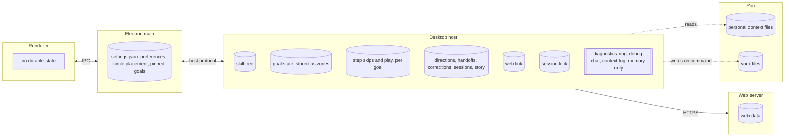

# Dum architecture

Dum is an always-on Mac app that follows your learning across your goals and implements things on command, only for skills you've proven or trusted. It shows up as one floating circle; a click unfolds it into a column of circles (Dum, up to three goals, the skill tree, the Monitor, Settings), and each circle opens its own panel.

## Processes and the state each one owns

## Ownership

| State | Sole owner | Why |
|---|---|---|
| Skill tree: skill notes, removal record, mapped prerequisites | Desktop host | "We are getting rid of the cli though, idrk it's upto you." With the CLI gone, the host is the only writer left. |
| Goal state, stored as zones: conversation, memory, evidence, suggested projects, change history | Desktop host | "Let's actually fuck the repos, it's kinda annoying." Goals are the only scope. The code and the files on disk still say zone (`zones.json`, `zones/<id>/`). |
| Steps (`zones/<id>/steps.json`): skipped steps, the whole-goal skip mark, the skill being played | Desktop host | Each goal's one next step is derived by the host from state it already owns (`src/steps.ts`); only the skips and the play pick are stored. Skipping a skill step writes trust through the evidence ledger, not here. |
| Web link (where your tree syncs) | Desktop host | "We are getting rid of the cli though." The CLI was the only writer. |
| Session lock | Desktop host | "We are getting rid of the cli though." Only the desktop runs a conversation. |
| Desktop settings (`settings.json`): preferences, circle placement per display, pinned goals (at most 3) | Electron main | Already its only writer. The circle's placement and the goals pinned to the column sit in the same file; the renderer only reports a press or a pin and main does the rest. |
| Directions: goal alignment attempts and agreed directions (`zones/<id>/direction/`) | Desktop host | Written under the host's writer lock with the rest of a zone's state. The zone registry stays the only owner of goal text; a direction keeps a fingerprint of the goal it was agreed for. |
| Handoffs (`zones/<id>/delegations/`) | Desktop host | Selected, edited, run and reviewed through the host, which also runs the gate check before each write. |
| Context corrections (`zones/<id>/context-corrections.json`) | Desktop host | Same writer as the context they correct. |
| Sessions and trails (`zones/<id>/sessions/`) | Desktop host | The host sees every send, decision, handoff, change and look result that a trail records. |
| Story cache (`zones/<id>/story/`) | Desktop host | A cache rebuilt from sessions, which stay authoritative. |
| Diagnostics ring and debug chat | Desktop host, memory only | Nothing durable. Main sends its own sanitized events to the host; the ring and the debug transcript go when the host exits. |
| Context log (the Monitor's live log, at most 200 entries) | Desktop host, memory only | The host runs the look and the Wizard's chime, so it sees each note, app switch, skipped look, failure, pause and chime first. Gone when the host exits. |
| Web-data (synced trees) | Web server | Already its only writer. Not a choice you made. |
| Personal context files | You | Dum only reads them. |
| Your files | You | "Tolerate it." Dum writes them only on command, under rule 7. |

## Glossary

- **Goal**: something you're working toward, e.g. `Programming › Data Structures`. Opening a goal makes it the active context. Goals are the only scope, and the user only ever reads "goal".
- **Zone**: the storage name for a goal (`zones.json`, `~/.dum/zones/<id>/`, `Zone*` in code). Never shown to the user.
- **Step**: a goal's one next thing to do, in one sentence, derived by the host: align, then a project, then the next milestone, then the next skill on the goal's path (recognize, then build). It has "Pick … for me" and Skip, and goes away once done.
- **Trusted**: a skill you skipped, recorded as your own word at build level (a self-report, not a review). It counts for the gate and shows dashed in the tree. Undo trust removes the skill.
- **Play**: ▶ on a skill, or ▶ Play for the recommended next one, makes it the active goal's step.
- **Skill**: a named ability, scoped to a language or to none, on one global tree.
- **Recognize**: you explained what a skill is and what it's for, in your own words.
- **Build**: you wrote it yourself, unaided. Only this evidence level; never a compile or packaging step. (You said "idk"; my choice.)
- **Apply**: you built it and reasoned about when and why to use it.
- **Evidence**: the record a skill's level rests on.
- **Concept**: a skill you must build before Dum writes it: a language feature, data structure or algorithm.
- **Tool**: a skill that is one library, framework, API or command; recognize is enough for Dum to use it. Functions the model can call are "actions", never "tools". (You said "idk"; my choice.)
- **Gate**: the check that decides what Dum may write from your tree.
- **Boundary**: what Dum may do for you right now. Dum is "incredibly active": always on, it follows along, tracks your learning, and "implement[s] things on command assuming that you have the skill".
- **Direction**: what you and Dum agreed a goal means: the ability you're after, how you'll know it worked, assumptions, and the chosen learning project or decision. One per goal, revisable, and it gives Dum no permission to write.
- **Handoff**: one task you chose to delegate, with its expected result and what you'll review. Choosing it writes nothing; Dum works on it only after you press Do this, and your review afterward is recorded but never counts as evidence.
- **Session**: one continuous stretch of learning in one goal. It ends when you leave the goal, start a new session, change what Dum works from (mode, backend, goal, notes, personal context, direction, corrections), quit, or go 30 minutes without activity.
- **Trail**: a session's ordered skill visits, with markers for agreed directions and handoff steps. A revisit is a new visit; an edge means "came next", never "is a prerequisite of".
- **Story**: your sessions across time, read goal by goal. A cache over the sessions, rebuilt when it falls behind.
- **Debug chat**: an independent chat in Settings that answers questions about Dum itself from read-only diagnostics. It never sees a goal and can't change anything.
- **Change**: a file Dum writes on command, applied directly, with a diff shown after and one-click revert. Replaces "proposal".
- **Practice**: "suggested projects that fit a skill's scope well". No guided practice.
- **Track**: a curated ladder of skills with prerequisites.
- **Wizard**: the advisor that helps you decide. Teaching comes later: "the wizard should be there for basic learning eventually, but for now i think it should just be there to help you decide."

## Rules

1. Dum only automates what you've proven you know, or told it to trust. A trusted skill is your word, shown as trusted, never as proven.
2. Goals are the only scope. Dum is never tied to a Git repository.
3. Dum is a Mac app. There is no terminal edition. It's one circle that becomes many: "it go from one circle to many, and then if you click it it animates to a column of circles … each one you click can have it's own ui". Dum, each goal, the skill tree, the Monitor and Settings get their own panel.
4. Every piece of durable state has exactly one owner process, as listed in the ownership table.
5. Model calls may run in the desktop host and in Electron main ("allow both").
6. On command, when you hold the skills, Dum writes the change directly. There is no yes/no step. It shows the diff after and offers a one-click revert.
7. Your editor is a writer Dum tolerates. Dum writes a file only if it hasn't changed since Dum last read it.
8. Dum is always on. It follows along and tracks your learning. It looks every 3 seconds and calls a model only when something changed.
9. Practice means suggested projects that fit a skill's scope. No guided practices.
10. Voice and keyboard are both first-class. Voice goes through OpenSuperWhisper, and everything works from the keyboard without the mouse.
11. Dum may run on agents other than Claude, and you pick the backend and model.
12. Dum connects to cloud models only with your own API key: "let's just have dum be strictly api keys for now". There is no subscription sign-in.
13. Dum's job is to help you delegate: "you have to tell dum what you need done ultimately. I think the goal should be to help you delegate something." As your skills grow, beginner work moves to the intern, so your workload doesn't grow with them.
14. Every goal starts with alignment: "at the beginning of every goal, you need to prompt to make sure you and your intern are on the same page, it can suggest projects/decisions to make to move you towards your goal." Alignment is a step, and like every step it can be skipped: "THERE ALWAYS NEEDS TO BE A WAY TO SKIP GOALS. like especially the beginner ones there needs to be a trust system". Beginner skills skip in one click; others ask first. Skipping a goal trusts its path.
15. The Wizard helps you decide, and it chimes in when you're stuck: "if it looks like the person is confused i want the wizard to jump in quite frequently". When the look sees the same error again, an undo/redo loop, the same search again, or a failing test or error dialog, the Wizard says one sentence: a concrete nudge toward what to check next, never the full answer, never code or links. It chimes at most once every 60 s (`LOOK_LOG.wizardGapMs`). Otherwise it doesn't post unprompted teaching tips. Its line in the bubble is the one exception to the one-sentence rule: "i need the text bubble to not disappear until you have completed it, unless the wizard needs to chime in the text bubble should literally be one sentence maximum". The step bubble stays until the step is done, skipped or replaced. The Monitor shows the host's context log at all times ("i want it have the context log going at all times"): notes, app switches, skips, failures, pauses and chimes, in memory only.

## Known limitations

None. You chose not to leave any of the inventory's multi-writer or boundary problems unfixed.
