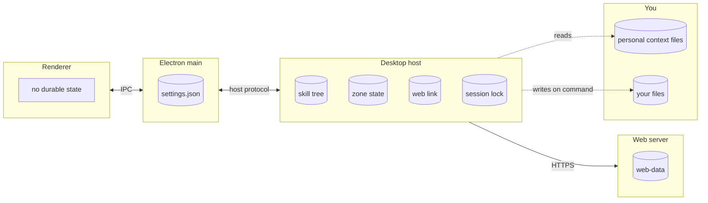

# Dum architecture

Dum is an always-on Mac app that follows your learning across a tree of zones and implements things on command, only for skills you've proven.

## Processes and the state each one owns

## Ownership

| State | Sole owner | Why |
|---|---|---|
| Skill tree: skill notes, removal record, mapped prerequisites | Desktop host | "We are getting rid of the cli though, idrk it's upto you." With the CLI gone, the host is the only writer left. |
| Zone state: conversation, memory, evidence, suggested projects, change history | Desktop host | "Let's actually fuck the repos, it's kinda annoying." Zones are the only scope. |
| Web link (where your tree syncs) | Desktop host | "We are getting rid of the cli though." The CLI was the only writer. |
| Session lock | Desktop host | "We are getting rid of the cli though." Only the desktop runs a conversation. |
| Desktop settings (`settings.json`) | Electron main | Already its only writer. Not a choice you made. |
| Web-data (synced trees) | Web server | Already its only writer. Not a choice you made. |
| Personal context files | You | Dum only reads them. |
| Your files | You | "Tolerate it." Dum writes them only on command, under rule 7. |

## Glossary

- **Zone**: a node in your context tree, e.g. `Programming › Data Structures`. Entering a zone sets the active context. Zones are the only scope.
- **Skill**: a named ability, scoped to a language or to none, on one global tree.
- **Recognize**: you explained what a skill is and what it's for, in your own words.
- **Build**: you wrote it yourself, unaided. Only this evidence level; never a compile or packaging step. (You said "idk"; my choice.)
- **Apply**: you built it and reasoned about when and why to use it.
- **Evidence**: the record a skill's level rests on.
- **Concept**: a skill you must build before Dum writes it: a language feature, data structure or algorithm.
- **Tool**: a skill that is one library, framework, API or command; recognize is enough for Dum to use it. Functions the model can call are "actions", never "tools". (You said "idk"; my choice.)
- **Gate**: the check that decides what Dum may write from your tree.
- **Boundary**: what Dum may do for you right now. Dum is "incredibly active": always on, it follows along, tracks your learning, and "implement[s] things on command assuming that you have the skill".
- **Change**: a file Dum writes on command, applied directly, with a diff shown after and one-click revert. Replaces "proposal".
- **Practice**: "suggested projects that fit a skill's scope well". No guided practice.
- **Track**: a curated ladder of skills with prerequisites.
- **Wizard**: the advisor.

## Rules

1. Dum only automates what you've proven you know.
2. Zones are the only scope. Dum is never tied to a Git repository.
3. Dum is a Mac app. There is no terminal edition.
4. Every piece of durable state has exactly one owner process, as listed in the ownership table.
5. Model calls may run in the desktop host and in Electron main ("allow both").
6. On command, when you hold the skills, Dum writes the change directly. There is no yes/no step. It shows the diff after and offers a one-click revert.
7. Your editor is a writer Dum tolerates. Dum writes a file only if it hasn't changed since Dum last read it.
8. Dum is always on. It follows along and tracks your learning.
9. Practice means suggested projects that fit a skill's scope. No guided practices.
10. Voice and keyboard are both first-class. Voice goes through OpenSuperWhisper, and everything works from the keyboard without the mouse.
11. Dum may run on agents other than Claude.

## Known limitations

None. You chose not to leave any of the inventory's multi-writer or boundary problems unfixed.
