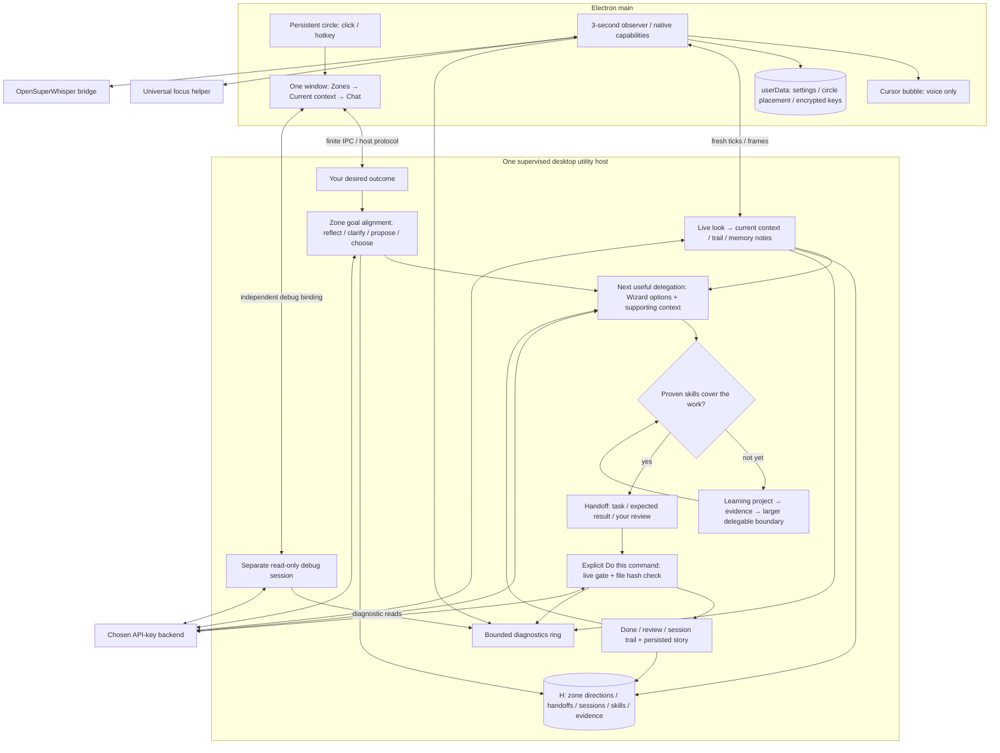

# Dum: delegate from the circle

## Superseded parts (goals column)

The goals column replaces §2 (circle window: one circle that only opens the window), §3 (working window: the strip, the zone crumb, the Context chevron, Hide and the section order) and §7 (bubble: the eight-line/600-character cut, "Open Dum for the full reply" and reply-only content). The Status line below describes the strip, which is gone too. The rest stands. Where this section and the rest disagree, this section and the code win.

- **Column.** One circle; a click unfolds it into a column of at most seven 56 DIP circles on one shared translucent capsule: Dum (the global goals folder, Dum's face), up to three goals (pinned, else the three most recently updated with the active one first), the skill tree, the Monitor and Settings. It folds back after 8 s with no pointer over it, or on Esc. `CircleView.slots`, `circle-pick`, `circle-collapse` in `src/desktop/protocol.ts`; `COLUMN` and `columnRect` in `surfaces.ts`.
- **Panels.** Picking a circle folds the column into it and opens its panel (`PanelRef`), all in one dark theme: Dum 400×560 (the "What do you want to work toward?" prompt and the nested goal list; a row opens its goal, pin and skip are hover icons), Goal 440×640 (header and progress, the step cloud, chat with a one-line composer and Stop only while running, a Path strip with ▶ per skill; More has Edit goal, New goal inside, Delete goal, Suggested projects, Changes, Memory), Tree 760×560 (Graph | Tree, track filter, Tidy, ▶ Play), Monitor 400×560 (Recording / Paused / Not recording: why, look model, last check, pictures, Pause/Resume, the live context log), Settings 400×560 (including Mode and Move circle). The panel's top-left corner sits at the circle's disk center and flips left/up when there's no room (`placePanel`). Esc backs out of a panel one step at a time.
- **Goals.** The user reads "goal" everywhere; storage stays zones (`zones.json`, `~/.dum/zones/`), with no migration. Pins are main-owned in `settings.json` (`pinned`, at most 3).
- **Steps.** Each goal has exactly one next step, one sentence, derived by the host (`src/steps.ts`, types in `src/step-types.ts`): align → project → next milestone → next path skill (recognize, then build). Each has "Pick … for me" (a fixed prompt sent as if typed) and Skip; it goes away once done. Skips live in `zones/<id>/steps.json`, host-written only.
- **Trust.** Skipping a skill step records it through evidence's self-report (`how: "added"`, build), so it counts for the gate and shows as trusted (dashed). Beginner skills skip in one click; others need a confirmed "Sure?" (`confirmSkip`). Skipping a goal trusts every unheld path skill, prerequisites first. Undo trust removes the skill.
- **Play.** ▶ on a skill, or ▶ Play for `NextSkill`, makes it the active goal's step.
- **Bubble.** A click-through thought cloud with puffs trailing toward the circle; no buttons, no input, and the bubble role invokes nothing (`BubbleAPI`). Beside the circle: the active goal's step, which never times out and hides only while the window is visible and focused, or the Wizard's chime (purple, 20 s, at most once per 60 s, when the look sees the user stuck). At the cursor: voice status, or a reply of one sentence of Dum's plus at most one Wizard line (`bubbleLines`). Pick … for me and Skip live in the goal panel's step cloud and on the graph card. The host's context log (`LOOK_LOG`, ≤200 entries, memory only) feeds the Monitor.

Status: the strip layout in `src/desktop/ui/window.ts` supersedes the three-section header below: the window opens on Chat with one slim strip (zone crumb, look chip, goal, Context chevron that expands Current context and the zone tree, Settings cog, Hide) and a Chat header of Mode · Menu · Move circle; "Zones → Current context → Chat" and the "Skills / Records" menu in §3 are the earlier contract. Otherwise: implementation contract, not implemented behavior. Ryan's circle and delegation decisions are fixed. Sizes, thresholds, schemas and signatures below are **target choices** unless labeled **Current**. Relative citations refer to this checkout; `/tmp/dum-live-look/...` citations identify the separate work-in-flight checkout. Both changed during inspection; latest reads in this checkout now also show three model roles, API-key setup and observation-only look. They supersede earlier ambient/settings assumptions.

## 1. Decision and grounding

Dum helps you make the next useful delegation: **understand your desired outcome → align on the zone's goal → choose work you can delegate now → commit a clear handoff → command Dum to do it → review the result and retain its trail**. Work outside proven ability becomes a suggested learning project that unlocks the next handoff. As ability grows, repeatable beginner work moves to Dum rather than accumulating on your workload. This is the product aim, not a measured workload or learning-rate claim.

One persistent floating circle opens one working window: **Zones → Current context → Chat**. No Tray, command window, separate panel, Dock entry or unsolicited ambient bubble. Settings, records, skills and story are in-window views, never additional BrowserWindows. The cursor bubble remains a noninteractive voice surface. Wizard decision cards belong to this chat, not a second conversation.



Binding rules: host owns zone/tree state, main owns desktop settings, personal files remain user-owned; one durable writer per record (`docs/architecture.md:37-46,67-77`). API keys only is binding (`/tmp/dum-live-look/docs/architecture.md:78`); use the inspected live-look checkout as the integration baseline. Older surfaces/settings-owner text is not a competing contract (`docs/revamp-design.md:181-191,262`; `docs/llm-setup-design.md:31,46,428-430`).

**Two distinct commitments:** approving a direction or selecting a suggestion stores intent only. **Do this** is the explicit implementation command under rule 6, not permission to run later and not a plan-approval gate. After that command, permitted changes apply directly with a diff and hash-checked Revert; no second yes/no step. Rule 1 still checks skill kind/level, language, prerequisites, holds and every affected file (`src/gate.ts:49-81,122-167`; `src/session.ts:353-398`; `src/changes.ts:38-140`). Recommendations, a goal, a chosen project, screen observations and chat confidence never prove ability.

**Current seams to reuse:**

| Observed code | Consequence |
|---|---|
| Main creates panel, command and bubble windows, with different focus/topmost policies (`src/desktop/main.ts:146-195`); builds the Tray menu (`src/desktop/main.ts:536-582`). | Replace the first two windows and Tray, retain bubble isolation. |
| `Focus.capture/restore` use opaque helper-lifetime handles (`src/desktop/focus.ts:39-58`); `FocusReturn` also has a panel-return branch (`src/desktop/surfaces.ts:166-200`). | Reuse native app restoration; remove the obsolete internal-panel branch. |
| `Composer`, `Transcript`, `ZoneTree`, `SkillTree`, `ChangesPane`, `AgentSheet` are separate components (`src/desktop/ui/panel.ts:8-15`). | Replace shell composition, not their functional contracts. |
| Per-zone history is bounded, not a permanent session archive: newest 500 entries / 4 MiB (`src/memory.ts:51-103`; `src/zone-types.ts:74-77`). | Direction, handoff and trail source links need independent retained records. |
| Main settings are in Electron userData, not H (`src/desktop/settings.ts:1-13,89-90`). | Circle placement stays main-owned there. Do not relocate settings as a UI side effect. |
| Live-look has `intern/helper/look`, previous observation and a `screen` trigger (`/tmp/dum-live-look/src/agent/types.ts:10-18`; `/tmp/dum-live-look/src/observe-types.ts:51-65`). | Reuse its observation-only look call, not Wizard teaching or a recommendation every tick. |

Live-look's intended default is Haiku 5.5; its defaults use `haiku/low` (`/tmp/dum-live-look/src/agent/schema.ts:11-21`). Its image allowlist still contains only Opus/Fable (`/tmp/dum-live-look/src/agent/claude.ts:33-45`); real Haiku image verification/catalog resolution is a release prerequisite, never bypass the check. Preserve changed 3-second ticks, one flight, fresh-frame dedup, blocking and timeout behavior (`/tmp/dum-live-look/src/observe-types.ts:10-44`; `/tmp/dum-live-look/src/ambient.ts:313-406`). The first implementation milestone proves one delegation using explicit context; rich look-derived context follows that proof.

## 2. Circle window

### Geometry, interaction and storage

- One circle for the app, not one per display. BrowserWindow 64×64 DIP; visible blackish disk `#151419`, diameter 56 DIP, centered with 4 DIP transparent padding. No text beside it. Existing Dum face inside, integer pixel scale 4 (7×8 art becomes 28×32); no new logo/art stack. Existing art and animation API: `src/art/intern.txt:13-101`, `src/desktop/ui/sprites.ts:8,37-103`.
- Options: `frame:false`, `transparent:true`, transparent background, `hasShadow:false`, `resizable:false`, `movable:false`, `focusable:false`, `skipTaskbar:true`, `fullscreenable:false`, macOS `type:"panel"`. Main sets topmost `"floating"`, all workspaces with `{visibleOnFullScreen:true,skipTransformProcessType:true}`, and uses `showInactive()`. Hide circle and bubble on sleep/lock; restore circle without activation on unlock. Never overlay secure OS UI. Keep current no-Dock behavior (`src/desktop/main.ts:134-135`).
- Do **not** use CSS `-webkit-app-region:drag`: every pixel is a button until movement proves a drag. Primary pointer down starts a main-issued gesture; pointer capture preserves release outside the disk. Main samples `screen.getCursorScreenPoint()` and computes global DIP deltas, not renderer positions. Movement ≥6 DIP from the start, at any point, makes the whole gesture a drag. No delay before movement. Release below threshold and within 500 ms toggles the working window; a stationary longer hold does nothing. Suppress synthetic click after drag; double clicks have no second action (250 ms toggle debounce). Ignore secondary/multitouch input.
- Main updates bounds at most once per 16 ms during a drag; renderer does not broadcast full snapshots on each move. Pointer cancel/lost capture restores starting placement and does not open/save. A 10-second missing-release ceiling cancels the gesture. Commit position once on successful drag end, not every pointer event. Native picker/input leases cannot outlive their operation.
- Clamp the **whole** 64×64 rect to a display's `workArea`, 8 DIP inset. Pick the nearest display to the pointer during drag, including negative origins. Crossing a gap clamps to that nearest display; no snapping to edges. Scale-factor changes never multiply global DIP positions. Reuse `clampInto/reclamp` geometry (`src/desktop/surfaces.ts:27-73`).
- Default: primary display, 8 DIP from its right work-area edge, 35% down its usable vertical range. Store one placement per Electron display ID (string), normalized top-left fractions `u/v ∈ [0,1]` over the available travel range. This survives resolution/work-area changes without offscreen coordinates. IDs are matching hints, not guaranteed hardware identities.
- Main stores `{version:3,settings:DesktopPreferences,circle:{lastChosenDisplayId:string|null,placements:CirclePlacement[]}}` in `userData/settings.json`, retaining its 64 KiB read bound. `CirclePlacement={displayId:string,u:number,v:number,usedAt:string}`; max 16 records, evict least recently **user-selected** placement only. `DesktopSettings.set(prefs)` must preserve placement; `setCircle(layout)` must preserve prefs. Migrate V2 without changing preferences or importing the obsolete V1 companion position. Current migration already discards that position (`src/desktop/settings.ts:17-31,93-112`).
- Display removed: cancel drag, move to the remaining work area nearest the old center, re-anchor the working window; do not overwrite the removed display's placement or `lastChosenDisplayId`. Metrics changed: restore normalized placement then clamp. Display added: do not teleport mid-use; on next launch restore the last user-selected display if present, otherwise use nearest/primary fallback. Explicit **Move circle → Display** restores that display's cached position. After a successful user drag/display selection, persist its ID. No displays: defer placement/show until a display exists.

### Round hit region and keyboard

Transparency alone is not a promise of click-through corners. Electron documents `setShape` for Windows/Linux, not macOS ([BrowserWindow](https://www.electronjs.org/docs/latest/api/browser-window#winsetshaperects-windows-linux-experimental)); whole-window `setIgnoreMouseEvents` is available ([API](https://www.electronjs.org/docs/latest/api/browser-window#winsetignoremouseeventsignore-options)). Target implementation: main checks cursor against radius 28 DIP at 16 ms while circle is visible; set ignore-mouse-events outside the disk, never during a captured drag. Reuse this timer for drag movement, stop on hide/lock, and avoid repeated unchanged native calls. Transparent padding must not open Dum. Pointer-entry timing/corner pass-through are **Mac release tests**, not assumed guarantees; see §11.

The circle never activates Dum on press, so focus capture can still identify the external app on release. Global summon is the keyboard entry. Expose a labeled accessibility button, “Dum — [state]. Open Dum”, with a press action routed to toggle; decorative canvas is hidden from accessibility. In the working window, **Move circle** offers display selection and keyboard positioning: arrows 10 DIP, Shift+arrows 1 DIP, Enter commits, Esc restores. Every mouse operation has that keyboard equivalent; no global unmodified arrows/Esc. VoiceOver discoverability of the nonactivating window needs real-Mac proof.

### Face and state

Main computes a small `CircleView`, not a copy of the transcript. Priority: listening/transcribing → needs attention → thinking → looking → idle.

| State | Trigger | Existing face / non-color-only indicator |
|---|---|---|
| idle | No foreground work; observer watching or paused | `idle`; paused has a static broken ring and accessible “look paused”. |
| looking | Live-look call checking, not every timer tick | `thinking`, thin dotted ring; accessible “looking”. |
| thinking | Zone request or debug turn busy | `thinking`, solid moving arc; label distinguishes debug. |
| listening | Recording or transcribing | `asking`, microphone-shaped notch; label distinguishes transcription. |
| needs attention | Pending explicit decision, host failure, required setup, rejected key, voice error or unusable selected look route | `blocked`, persistent `!` badge; status explains reason on opening. |

Reduce motion to the first sprite frame and static indicators. A denied screen permission with app/files observation still usable is shown in Current context, not a permanent failure alarm. An unchanged, healthy screen uses idle, not perpetual animation. State is derived from typed fields; do not regex-match status prose as today's shell does (`src/desktop/ui/panel.ts:547-552`).

## 3. Working window

### Placement, open/close and focus

One frameless, focusable 640×720 DIP macOS panel, fixed size, `minimizable/maximizable/fullscreenable:false`, topmost `floating`, visible on all Spaces/full-screen while open. Shrink to the work area with 8 DIP margins; narrow layout remains usable down to 360×480 when available. Smaller work areas get scrollable content, not offscreen controls.

`placeWindow(circle:Rect, area:Rect, wanted:Size):Rect`: prefer right of circle with 12 DIP gap, vertically centered on its center. If right cannot fit, try left; if neither fits, choose the side with more room then clamp. The clamped small-display layout may overlap the circle; dismissal/hotkey still work. Re-anchor on drag completion/display changes, never follow the cursor. No separate durable working-window position/size.

- Circle click/global summon: hidden → capture previous app, place, show/focus composer; visible but unfocused → capture that external app and activate; focused → dismiss. Serialize summons so delayed capture cannot reopen after dismissal. First run opens the same window at **What are you trying to learn?**, the local start of goal alignment (§4), not model setup. Second-instance/OS activate shows this same window.
- Esc: close inner chooser/form/graph detail first; then close an in-window auxiliary view back to Chat; then hide the working window. Preserve canonical zone draft, alignment draft, ready handoff and active host request. Esc is never Stop, dismiss recommendation, No, consent or attestation. `Cmd+.` is explicit Stop for the active chat (debug Stop when debug has focus). `Cmd+W` hides; `Cmd+Q` uses controlled Quit. Return sends, Shift+Return newline, IME Return ignored.
- Blur to an external app hides the window, **without** restoring the captured app: the user just chose a different focus target. Blur caused by the circle, an owned native picker/confirmation/permission operation or an inner view does not auto-hide until that operation settles. External browser links may hide Dum; never reactivate it when capture/link work completes.
- Explicit hide/toggle/Esc/close calls `FocusReturn.dismiss():Promise<boolean>` once. Target `summon():Promise<void>` captures external application only; remove `panelFocused` and `"panel"` returns. Reuse `Focus` unchanged. Capture before activation; failed/expired capture hides without arbitrary PID activation. Do not call `app.hide()` in a way that hides the persistent circle. Return the **application**, not an unverified editor caret/window (`docs/revamp-design.md:216`; `src/desktop/focus.ts:47-52`).

### Exact content order

```text
Zones                 [active breadcrumb / switch ▾] [Manage] [Settings] [Hide]
  compact zone tree / create, enter, edit, delete (expandable; max 136 DIP)
Current context       [look state + reason] [Pause / Resume]
  Your goal · Agreed direction / Alignment needed [Revise]
  Using: goal, chosen direction, named notes / observation time [Inspect / Correct]
  This session: vectors (C++) → linear search → binary search
  Delegable now: … · Next unlock: … (skill / evidence links, no score from chat)
  [This session] [Full story] [Context / followed folders] [New session]
Chat                  [Mode: understand ▾] [Skills / Records ▾] [Move circle]
  Your outcome: … [Edit]                 [Help me decide]
  Dum: reflection / few consequential questions
  Wizard: 2–3 options + tradeoffs + “Based on …” [Choose] [Revise] [Dismiss]
  Handoff: task · expected result · what you review [Edit] [Do this] [Dismiss]
  result / applied diffs + Revert / review record
  [canonical draft......................................................]
  [Share] [Voice start/stop/cancel] [Stop] [Send]
```

At normal size: Zones header 40 DIP plus ≤96 DIP expandable tree; Current context ≤200 DIP; Chat gets remaining height with a min 220 DIP reading/composer area. On short displays, collapse tree to breadcrumb and context graph to latest step + **This session**, but retain goal/direction and **Using / Correct** access. Each expandable region scrolls independently; composer stays in Chat. Tab order follows this visual order. `Cmd+K` opens existing zone switcher; roving zone arrows/Home/End/Right/Left, Enter enter, F2 edit remain. Zone identity, language/inheritance, deletion and existing revision cancellation remain; create/goal-edit add alignment, not a new zone scope. Existing controls are at `src/desktop/ui/zones.ts:61-81,95-141,146-247`. Do not sneak in reparenting/focus-skill editing (`docs/todo.md:32-34`).

Settings is a sheet **inside the Chat region**, with Back and a trapped/labeled focus sequence; Zones and Current context remain above it. Story, Skills and Records use that same region, preserving Chat scroll/draft and returning focus to their opener. No new “main screen”. Skills retains global progress/tier information (usable built skills, not messages: `src/desktop/ui/panel.ts:73-76,553-561`). Records includes Memory (remember/open file), conversation History, Evidence, Boundary, Suggested projects (all start/stop/submit/unaided controls) and Changes (inspect/Revert/open record). Zone notes and inherited context are under **Context**; personal context remains separate. Controls to migrate: `src/desktop/ui/panel.ts:214-277,464-495`; `src/desktop/ui/change-view.ts:18-82`. Historical entry rendering, including legacy plan/course cards, stays read-only (`src/desktop/ui/transcript.ts:110-205`).

### Chat and the useful handoff

The zone goal is the long-running outcome; a chat outcome is the concrete thing you need done next. Dum reflects that outcome before proposing work. You may state it directly, edit it, reject every suggestion or send your own permitted command. Alignment never blocks ordinary chat, Settings or an explicit gated implementation. Dismiss is a one-action, keyboard-reachable control; do not resurface the dismissed recommendation until you ask again or change the outcome. No reminder nags, forced quiz or skill-tree maintenance.

At an alignment/delegation moment, offer at most three concrete choices (normally two), with task/project/decision, relevant skills, why it advances the stated goal/outcome, supporting context, missing assumptions and one real tradeoff per choice. Ask at most two questions in a turn, only if their answers change scope, ordering, gate eligibility or expected result. Then show options; if material ambiguity remains, mark the affected choice **Needs …** and ask only that missing detail when selected. Never guess a consequential detail to meet the question limit. **Use my own plan** preserves the user's wording.

One choice is the recommended **next useful delegation**, not a queue of homework. Host labels it **Can delegate now** only against the existing live gate; **Learn first** names the smallest missing skill/prerequisite and a suggested unaided project using the existing project/evidence path. Do not automate the unproven part or lower the gate to make the card useful. When proof really changes, **Delegable now** refreshes and can explain “you can now hand off this part”; it never expands scope or runs work automatically. Repeatable proven parts stay delegable while the user learns the next part.

Selecting an eligible option creates one editable ready handoff: **clear task, expected result, what you will review**, actual skill refs and required current shares/destination. Include “Based on …” links and unresolved blockers. All three text fields are mandatory. Selection and editing write no source files. **Do this** consumes the current card version and current input/draft binding; it is the command. Main obtains only the usual explicit file grants/destination consent, host rechecks gate and source hashes at each change, then applies directly. No plan approval between command and write. Typed commands keep the same direct-write path; no new mandatory card ceremony.

Completion reports actual receipts/diffs and which expected-result checks were observed; never equate model prose with a verified result. Status is **done, awaiting your review**, **blocked**, **failed**, **cancelled**, or **interrupted**, with partial changes listed and Revert available. A deliberate **Reviewed** action stores the user's verdict against the expected result; it is not competency evidence. The trail links the handoff, outcome/direction revision, changes and any independently earned proof. No code execution/shell authority is added to check results.

### Wizard: decisions now

Wizard appears as labeled options/tradeoffs cards in the same Chat transcript at goal alignment and when the user asks for the next delegation or **Help me decide**. Dum owns the outcome and handoff; Wizard helps compare approaches, risks and the learn-first alternative. One canonical input, one host turn, no competing chat or fourth model role. Use the selected helper for bounded, action-free decision composition; validated cards return to the host. Chat remains available if helper/backend is unavailable; show that decision help is unavailable, never fabricate recommendations.

Unprompted teaching asides are **off now by removal**, not a toggle. Live look still supplies current observations, skill trail hints and memory notes (§4), but never pushes a Wizard lesson, unsolicited recommendation or ambient transcript quip. Requested explanations, recognition/review and suggested projects remain ordinary Dum learning paths; the later basic-learning Wizard is not implemented here. Exact retained/deleted Wizard functions and callers are in §8.

## 4. Goal alignment, Current context, session trail and story

### Goal-start alignment and its revisions

Alignment belongs to **each zone's own goal**, not the app, parent, session or Git folder. Run the flow after creating a zone with a nonempty goal and after committing a changed goal; first-run **What are you trying to learn?** creates the root locally and starts that same flow. Keep the exact trimmed goal and existing root naming/language behavior; no inferred skills. Model work waits for API-key/backend setup, preserves the local goal and resumes alignment, not an implementation command.

1. **Reflect:** Dum says “Here's what I think you want to become able to do”, with the user's goal visible beside the reflection. Reflection is editable and not a replacement goal.
2. **Clarify:** zero to two questions whose answers change the plan (§3); include why each matters. Do not ask for context already available or demand a biography.
3. **Propose:** Wizard supplies two or three projects/decisions, each with the skill it builds, why it advances this goal, supporting context and tradeoffs. Label whether it is a learning project or work eligible for delegation now. A missing material detail is an explicit blocker, not a guessed fact.
4. **Choose together:** **Use this direction**, **Revise**, or **Use my own direction**. Approve the edited direction, not a binding schedule or write permission. **Not now / Dismiss** leaves alignment needed and permits ordinary work. Resume only on explicit request or the next actual goal edit, not every window opening.

Creating/editing an inactive zone presents a labeled alignment card for **that zone** in the current goal-edit flow, without changing the active zone or using the active zone's memory/grants. If deferred, its badge is visible in Manage/when entered; no background model call. No backend or interruption leaves a persisted pending attempt, not a fabricated agreement. Existing zones receive **Alignment needed** on first use; do not invent a historical direction.

An approved direction contains the agreed ability/outcome, selected project/decision, relevant skills, why it advances the goal, review criterion, accepted assumptions and supporting context. **Revise** from Current context reruns reflection/choice with the last agreement as a labeled starting point. It creates a new immutable revision only on explicit acceptance. It can be changed at any time; no penalties or forced learning sequence.

A goal edit immediately makes the old direction non-current, cancels its pending recommendations/ready handoffs and starts a new alignment attempt. Compare the stored goal fingerprint with the committed leaf goal on every read/recovery; a crash between registry and direction writes cannot expose the old agreement as current. Goals remain nonempty, as today (`src/zone-types.ts:89`). Unchanged goal text/renames do not retrigger goal-start alignment. Language/notes/ancestor/personal-context changes invalidate in-flight cards through context revision; show **Context changed — review direction** but do not silently rewrite agreement. Accepted direction revisions affecting the active zone follow the existing reconfiguration/session boundary.

### Storage: directions and handoffs

The host under H's writer lock is the **single owner** of alignment attempts, agreed directions, handoffs, context corrections and trails. Registry remains the sole owner of goal text; direction stores a goal snapshot/fingerprint for provenance, never a second editable goal. Current goal/context primitives and limits are `src/zone-types.ts:10-38,67-89`; registry creation/edit writes are `src/zones.ts:132-166,227-247`. New paths:

```text
H/zones/<id>/
  direction/head.json                  current revision + pending alignment attempt
  direction/revisions/<revisionId>.json  immutable approved direction
  context-corrections.json              ignored latest observation; correction revision
  delegations/<handoffId>/head.json      current handoff version / execution state
  delegations/<handoffId>/versions/<version>.json  immutable task/expected/review
  # sessions/ and story/ below; existing zone files remain
```

```ts
// src/delegation-types.ts; IDs/times/revisions are host-issued; strict schemas
type ContextRef = {
  id:string; kind:"goal"|"direction"|"zone-note"|"memory"|"personal"|"look"|
    "conversation"|"skill"|"evidence"|"share";
  label:string; revision:string; at:string|null; excerpt:string;
};
type DirectionOption = {
  id:string; kind:"project"|"decision"; title:string; builds:SkillRef[];
  advancesGoal:string; contextIds:string[]; tradeoff:string;
};
type Direction = {
  version:1; id:string; zoneId:string; at:string; goal:string; goalHash:string;
  supersedes:string|null; ability:string; choice:DirectionOption;
  reviewCriterion:string; assumptions:string[]; context:ContextRef[];
};
type AlignmentAttempt = {
  id:string; goalHash:string; contextRevision:string;
  phase:"reflect"|"clarify"|"choose"|"deferred"|"needs-backend";
  reflection:string; questions:{id:string;text:string;changesPlan:string;answer:string|null}[];
  options:DirectionOption[]; context:ContextRef[];
};
type DirectionHead = {
  version:1; revision:number; goalHash:string; currentId:string|null;
  attempt:AlignmentAttempt|null;
};
type ContextCorrections = {
  version:1; revision:number; ignoredObservationSourceId:string|null;
};
type Handoff = {
  version:1; id:string; revision:number; zoneId:string; sessionId:string;
  directionId:string|null; goalHash:string; contextRevision:string; outcome:string;
  task:string; expectedResult:string; review:string; skills:SkillRef[];
  targets:string[]; context:ContextRef[];
};
type HandoffHead = {
  version:1; id:string; revision:number; requestId:string|null;
  state:"ready"|"running"|"done"|"blocked"|"failed"|"cancelled"|"interrupted"|"dismissed";
  changeIds:string[]; result:string; reviewed:{at:string;verdict:string}|null;
};
```

Direction/head/corrections ≤32 KiB each; ≤3 options, ≤2 questions per attempt, ≤8 accepted assumptions. Text fields ≤2 KiB UTF-8 except goal snapshots retain the existing 2000-character limit and labels ≤160 chars; hashes/IDs use fixed validated forms. Context ≤16 refs, each excerpt ≤512 bytes, aggregate ≤8 KiB; revisions are content digests/host record revisions, not renderer paths. Skills ≤32 canonical refs, targets ≤16 broker-validated virtual resource names, handoff version ≤32 KiB/head ≤16 KiB; bounded result ≤2 KiB and ≤32 change IDs. Split larger work into a new explicitly chosen handoff, never silently truncate required skills/targets. Only one ready handoff/one running zone request; no accumulating job queue. Grants, raw images, audio, code bodies and credentials never persist in these records; a historical target never authorizes a read/write.

Revisions/finished handoffs referenced by trails remain retained with bounded files and uncapped total count. Attempts overwrite only that zone's bounded pending draft. Commit immutable direction/version first, then atomic head, then session event; publish after commit. A failed event write exposes recording failure; recovery links committed head once using direction ID, or handoff ID + version + lifecycle phase, as event idempotency key. Orphan records grant nothing; no multi-file transaction claim, no corrupt-record reset. Restart retains ready text but marks it **Needs refresh** for fresh session/context/grants; running becomes **interrupted**, never replayed. Repeated Do this on a consumed version cannot write twice. Persist each change receipt as it lands; a crash before handoff update reconciles known change manifests by requestId, never executes missing work. Partial changes remain visible after recording failure/interruption.

Target host APIs (`src/directions.ts`, `src/delegations.ts`, controller serializes mutation):

```ts
class Directions {
  constructor(home:string, now:()=>number);
  begin(zone:ZoneContext, context:readonly ContextRef[]):DirectionHead;
  draft(zoneId:string, expectedRevision:number, attempt:AlignmentAttempt):DirectionHead;
  accept(zone:ZoneContext, expectedRevision:number, direction:DirectionInput):Direction;
  read(zone:ZoneContext):DirectionView; // fingerprint check; bounded head + current
  revision(zoneId:string, id:string):Direction;
}
class Delegations {
  constructor(home:string, now:()=>number);
  ready(input:HandoffInput):Handoff;
  edit(id:string, expectedRevision:number, patch:HandoffEdit):Handoff;
  start(id:string, expectedRevision:number, requestId:string):Handoff;
  finish(id:string, requestId:string, result:HandoffResult):void;
  review(id:string, expectedRevision:number, verdict:string):void;
  read(zoneId:string, id:string):HandoffView;
}
```

`DirectionInput/HandoffInput/Edit/Result` are strict bounded DTOs derived from the records, excluding host-issued metadata; result status/receipts come from orchestration, not model claims. Storage services have **no source-write/evidence authority**. `HostController.runHandoff` calls the existing command/session path with fresh binding/grants and revalidates the card's goal/direction/context/version; choosing/accepting is never its caller.

`contextRevision` is a host-computed digest of explicit goal/direction, loaded zone-note/personal digests, correction revision and applicable settings; zone/session bindings are separate. Decision memory/observation refs are frozen at composition. Routine new look observations/memory appends are shown as newer context, not automatic cancellation of a ready handoff every three seconds; offer Refresh and preserve provenance. Explicit correction/reload/reconfiguration invalidates it. Skills/grants/hashes always recheck at command/write. A new session invalidates ready bindings without rerunning goal alignment.

### Current context: what Dum is using, and correction

Collapsed Current context shows the stated goal, current agreed direction or **Alignment needed**, the current request's **Using …** summary, latest observation/time/stale marker and recent trail. Show **Delegable now / Next unlock** as relevant skills and blockers, with tree/evidence links; no skill-tree maintenance task or promise of exponential progress. Expand to inspect the current boundary and the specific context behind the recommendation.

**Using / Inspect** inventories the host-selected inputs for the latest decision/request: own/inherited goals and labeled notes, agreement revision, memory, opted-in personal background, conversation excerpts, observation, proof/boundary and shares. Producers issue refs; models cannot invent citations. Decision help receives ≤16 selected refs, with omitted sources visibly listed before the call. Ordinary zone requests retain existing bounded source reads; their inventory pages are ≤50 refs / 32 KiB, excerpts ≤512 bytes, snapshot holds summary/cursor only. Show source/time/digest/missing/stale/omitted status; absent plan-changing context triggers clarification. Model text and screen text are untrusted data, not commands.

**Correct** is reachable here: edit goal/notes, revise direction, open memory to edit then Reload context, inspect personal background/open its named file or revoke Settings opt-in, stop following a folder, Ignore this observation. Ignoring excludes current observation from subsequent decision/mapping inputs until a fresh non-null successful observation replaces it; clear the look's previous-observation input too so it cannot feed itself back. Corrections are host-owned, never erase trail or unsend past inputs. Free-text correction is an explicit zone note, not proof. Reload/correction changes context revision, cancels stale cards and marks ready handoff **Needs refresh**; applied changes stay visible. No hidden context toggle.

Expanded diagnostics show look status **and blocking reason**, last tick/call times, selected/resolved look model, permission/no-picture reason and latest successful observation. Distinguish “unchanged; no call”, “checking”, “conversation busy”, “paused”, “permission denied”, “no backend” and “call failed”; failure retains the last observation but marks it stale. Never show “looking” as proof that a frame was sent.

### Trail and goal-relative story

Trail is an ordered chain of **skill visits**, not a prerequisite graph or competency score. Latest six visits appear inline; **This session** opens a paged 50-event view and chronological list equivalent. Repeating the current skill updates `lastSeenAt`; leaving and revisiting creates another visit with a dashed **revisit** link. No branching here. Solid edges mean “next observed topic”, not causality/prerequisite. Selecting a visit opens its skill detail, source excerpts and proof/change links. Keyboard arrows/Home/End select; Enter opens detail; Tab reaches each link. SVG connectors are decorative; an ordered DOM list is authoritative for assistive technology.

Direction chosen/revised, handoff commanded/completed/reviewed and independently earned evidence are timestamped markers along that chain, not fake skills. Each visit/marker carries the direction revision in force (or null, **not aligned**). Session detail starts with its agreed ability/review criterion. Progress is judged against that direction: completed/reviewed expected results, skill evidence and what became delegable; observations alone show activity, never success. The user verdict can be **did not advance the goal**; do not turn every visit into praise.

**Full story** lists persisted sessions newest first, filterable by zone/date/skill, with chronological browsing and the same details, historical directions/outcomes, handoffs, review verdicts and evidence. Default filter is this zone; **All zones** merges host-provided pages without loading all records. No model-generated retrospective: story is retained facts and user judgments. A new direction does not retroactively regrade old sessions. Deleted zones are archived/read-only; story confers no enter/share/write/open-path authority. Preserve tombstones.

### Mapping without granting skills

Current `curriculum.map` stores off-track **prerequisites**, not screen-topic classification (`src/curriculum.ts:105-143`); reuse its catalog/identity rules, not a second taxonomy. Use `canonical`, `locate`, `mapped`, `prereqs`, `skills.id/langName` and the global tree. Candidates include curated rungs (locked/open) and existing off-track notes; language-free refs remain language-free (`src/curriculum.ts:84-103`; `src/skills.ts:60-83`). Focus skills narrow relevance, never permission.

Target `TopicHint={topic:string,skill:SkillRef|null,confidence:number,reason:string}`: ≤3 hints/result, topic ≤160 chars, reason ≤240, finite confidence `[0,1]`. Host supplies ≤128 canonical candidates from active language/focus, literal matches and prerequisites, including relevant language-free skills. The model selects exact refs and explains off-tree→tree mapping; never auto-create skills/prerequisites/holds/proof.

- **Look:** extend the branch's note-only JSON with `topics:TopicHint[]`, retaining its 280-character observation and advice-free prompt (`/tmp/dum-live-look/src/ambient.ts:88-147`). `seen` remains the read-model field, not a second model output. Add `AmbientOptions.observed(result,input,at)` before the null-note return/memory throttle: branch updates `seen` before throttling and calls `record` only for a surviving note (`/tmp/dum-live-look/src/ambient.ts:378-397`). Reuse one look call. Keep note throttles; ambient aside machinery is already removed on the latest inspected branch, and must stay removed (§8). Validate zoneEpoch/context revision/session before **any** publication, including latest `seen`, not just memory writes; stale results change nothing.
- **Conversation:** annotation action `report_context({topics})` uses a host callback, not another helper. Consume validated refs from evidence/change/project operations too. Link the actual entry/artifact. Model wording is not unaided proof; annotations cannot write source or grant skill.
- Exact named refs with supporting source, or inferred refs with confidence ≥0.8 and rationale, may become visits. Confidence is an uncalibrated model claim, visibly **inferred**. Validate catalog membership/language; never trust model-issued paths/evidence UUIDs.
- No confident mapping: retain an **unmapped topic** gap, not a fake skill. **Map to skill…** uses the existing picker; explicit selection produces a user-mapped visit linked to the gap, no tree/evidence mutation.
- Multiple skills preserve reported order/source; consecutive identical refs coalesce. New visits/gaps/decision markers persist immediately. Repeated touches coalesce to one durable update/minute, flush on orderly end; crash can lose the final unflushed minute, not committed visits.

### Session boundaries

A **session** is one continuous activation of one zone for learning/delegation, distinct from a request, SDK session, UI opening or host epoch.

Start after successful zone load/enter (including startup restore/first root creation); on **New session**; or lazily on eligible activity after idle/sleep ended the preceding one. Eligible: explicit zone-chat Send, alignment acceptance/handoff command/review, accepted evidence/change/project action, or changed app/screen/file signal for this zone excluding Dum's surfaces. Clock ticks, animation, unchanged screens and debug are not activity. Inactive-zone alignment revisions persist in that zone, and appear as **direction before session** on its next activation; never attach them to the active zone's trail.

End on leave/delete, New session, 30 minutes without eligible activity (no request/voice in flight), sleep/lock, orderly Quit, host crash/restart, or active-context reconfiguration (mode, agent, personal context, active ancestor/goal/language/notes, accepted direction or context correction). Already-active enter is not a boundary. Failed switch ends old session as switch-attempt and starts fresh in restored zone; no old work resumes. Hide/blur/Esc, look pause/resume and ordinary Stop do not end sessions. Pause does not pause chat/idle; unlock waits for new activity.

**New session** cancels zone work/voice, revokes capabilities, rotates prompt/zoneEpoch, closes old trail and starts empty; direction stays agreed, alignment does not rerun. Keep history/memory/projects/evidence/changes/skills. Session-owned IDs disambiguate transcript integers. Restart closes unended sessions at last durable activity as `interrupted`; no invented downtime activity. Startup restore starts fresh. Current zone open restores history with a new epoch (`src/desktop/controller.ts:784-839`); backend sessions are per request (`src/session.ts:535-609`); neither is this durable session.

### On-disk trail contract: one host owner

`H=skills.home()`; host under H's writer lock owns session/trail/story writes. Main owns settings/placement, renderer none. Reuse private no-follow/atomic/exclusive primitives (`src/state-files.ts:1-4,151-200`) and host lock initialization (`src/desktop/controller.ts:214-237`). UTF-8 JSON/trailing newline, dirs 0700/files 0600; host UUIDs/UTC times; strict Zod schemas. No screenshots/audio/credentials/copied source-file bodies.

```text
H/zones/<id>/
  sessions/index.json                 catalog header; next page / active ID
  sessions/index/<page>.json          ordered IDs, append once/session
  sessions/<sessionId>/meta.json      lifecycle, latest context, counters
  sessions/<sessionId>/events/<page>.json   ordered events; old pages immutable
  sessions/<sessionId>/sources/<sourceId>.json  retained link material, immutable
  story/head.json                    rebuildable cache header, generation/revision
  story/pages/<page>.json             bounded summaries / source revisions
  # direction/, delegations/, corrections and existing zone files remain
```

```ts
// src/trail-types.ts; SkillRef reused from zone-types.ts
export type SessionMeta = {
  version:1; id:string; zoneId:string; zoneName:string; goal:string;
  directionId:string|null; // initial agreed revision; changes have event markers
  startedAt:string; endedAt:string|null; endReason:EndReason|null;
  lastActivityAt:string; revision:number; eventPages:number; eventCount:number;
  latestObservation:{sourceId:string; text:string; at:string}|null;
};
export type TrailStep = {
  id:string; skill:SkillRef; firstSeenAt:string; lastSeenAt:string;
  directionId:string|null; origin:"look"|"conversation"|"artifact"|"user-map";
  mapping:"exact"|"inferred"|"user"; topic:string; reason:string;
  sourceIds:string[]; revisitOf:string|null;
};
export type TrailEvent =
  | {seq:number; at:string; kind:"visit"; step:TrailStep}
  | {seq:number; at:string; kind:"touch"; stepId:string; sourceId:string|null}
  | {seq:number; at:string; kind:"gap"; id:string; topic:string; sourceId:string}
  | {seq:number; at:string; kind:"map-gap"; gapId:string; step:TrailStep}
  | {seq:number; at:string; kind:"direction"; directionId:string; previousId:string|null}
  | {seq:number; at:string; kind:"handoff"; handoffId:string; revision:number;
      phase:"commanded"|"done"|"blocked"|"failed"|"cancelled"|"interrupted"|"reviewed";
      directionId:string|null; sourceIds:string[]};
export type TrailSource = {
  version:1; id:string; sessionId:string; at:string;
  kind:"look"|"conversation"|"evidence"|"change"|"project"|"handoff";
  excerpt:string; entryId:number|null; requestId:string|null;
  evidenceId:string|null; changeId:string|null; handoffId:string|null;
  proof:RetainedProof|null; // existing validated Proof2, not a new ledger entry
};
export type StoryRow = {
  sessionId:string; zoneId:string; startedAt:string; endedAt:string|null;
  directionId:string|null; sourceRevision:number; visits:number; gaps:number;
  handoffsDone:number; handoffsReviewed:number; preview:SkillRef[];
};
```

`EndReason` is the explicit enum above. `RetainedProof` keeps UUID/time/kind/skill/lang/ok/why and bounded quote/unaided/feedback from existing evidence, without absolute paths/code. Sources are **supporting observations**, not competency Evidence. The current ledger keeps newest 200 records / 512 KiB (`src/evidence-types.ts:42`; `src/evidence.ts:57-66`); snapshots preserve readability, not current permission. Changes resolve through their host artifact service, never renderer paths. Missing artifacts are unavailable beside retained text; removed skills keep historical names with a removed label.

Bounds: meta/header ≤32 KiB; index page ≤128 IDs / 32 KiB; event page ≤128 events / 256 KiB; source ≤16 KiB, excerpt ≤2 KiB, proof ≤8 KiB; step ≤16 source refs (extras become touches); story page ≤128 rows / 256 KiB, preview ≤32 distinct refs + truncation count. Headers: index `{version:1,pages:number,sessions:number,activeSessionId:string|null}`; event page `{version:1,sessionId,page:number,events:TrailEvent[]}`; story head `{version:1,generation:string,pages:number,revision:number}`; story page `{version:1,generation,page:number,rows:StoryRow[]}`. Counters/page indices are nonnegative safe integers; IDs/refs host-validated. Rotate full pages; no total session/visit purge. Queries return ≤50 rows/events and ≤256 KiB, opaque cursor bound to filter/zone/revision, one disk page at a time. Show total usage in Story; full disk is visible recording failure, not eviction.

Commit source → event page → meta revision; publish only committed events. Create meta before catalog ID. Recovery incrementally reconciles interruption, using event idempotency keys for direction/handoff hooks; unreferenced sources grant no authority. Preserve corrupt/oversized records and label unreadable, never reset archive. Cache updates only after authoritative commit, detects `sourceRevision`, rebuilds into a fresh generation then swaps head. Never invent trails/directions from bounded history/memory; old conversation is **Earlier history (before trails)** in Records.

```ts
// src/trails.ts; serialized by caller
class Trails {
  constructor(home:string, now:()=>number);
  begin(zone:ZoneContext, directionId:string|null):SessionMeta;
  end(id:string, reason:EndReason):void;
  activity(id:string, at:number):void;
  observe(id:string, hints:readonly TopicHint[], source:TrailSourceInput):void;
  decision(id:string, event:DecisionEventInput, idempotencyKey:string):void;
  mapGap(id:string, gapId:string, skill:SkillRef):void;
  current(id:string|null):TrailView|null; // recent six visits + bounded markers/context
  read(zoneId:string, sessionId:string, cursor:string|null):TrailPage;
  source(zoneId:string, sessionId:string, sourceId:string):TrailSource;
  story(query:StoryQuery):StoryPage;
}
```

## 5. Ultra-minimal Settings: complete disposition

Settings contains exactly: **Agent** disclosure; **Look** disclosure (Apps, Screen, permission/status and Open Screen Recording settings); **Shortcuts** disclosure (three recorders/error); **Open at login**; **Use personal context** (resolved path/status, view-only); **Set up voice** with status; **Debug chat** disclosure; footer version/platform and **Quit Dum**. No theme, window-topmost, workspace or per-role-debug selector. Disclosures default collapsed except a required recovery. Settings still works with no zone/backend. This is fewer visible rows, not removal of model/permission/keyboard controls.

| Current setting/control and evidence | Target disposition |
|---|---|
| Agent backend, readiness, Check again; key Save/Replace/Remove (`src/desktop/ui/agent-sheet.ts:96-182`) | **Keep** in Agent disclosure; password-only transient entry, never reveal saved key. Use released backends/catalog only. |
| Intern/helper/look selectors, efforts, warnings and Use (`src/desktop/ui/agent-sheet.ts:16-19,207-270`) | **Keep** all three roles in Agent disclosure, capability/untested warnings and Use. Helper composes decisions, look observes; neither is an ambient teacher. Haiku screen input requires real image verification. |
| Key-only Claude setup and local no-credential guidance (`src/desktop/ui/agent-sheet.ts:167-187`) | **Keep** Save/Replace/Remove and local guidance. Other account/browser controls belong only to unreleased backend definitions (`src/desktop/ui/agent-sheet.ts:189-204`; `/tmp/dum-live-look/src/agent/registry.ts:5-6`); do not expose them in released setup. |
| Apps / Screen / screen-permission status and recovery (`src/desktop/ui/panel.ts:294-304,363-370`) | **Keep** in Look disclosure. Screen copy says one fresh frame per eligible changed 3-second tick, not “when Wizard asks”. Turning Screen off does not remove app/files observation. |
| Pause/Resume, duplicated header and Settings (`src/desktop/ui/panel.ts:96-102,303,366`) | **Move** exclusively to Current context. Pause remains explicit runtime state, visibly shown; not a settings write/session end. |
| Follow a folder, label/count, Stop following (`src/desktop/ui/panel.ts:305-306,371-374,439-444`) | **Move** to Current context → Context / followed folders. Preserve per-zone native grant/revocation, not generic sharing. No active zone disables add. |
| Mode understand/anti-vibe + explanation (`src/desktop/ui/panel.ts:35-38,307-309,389-391`) | **Move** to Chat header mode menu; retain global preference and identical skill gate. Mode changes use the reconfiguration session boundary. |
| Personal-context opt-in/file explanation (`src/desktop/ui/panel.ts:392-393`) | **Keep** one switch/resolved path/status in Settings. Inspect/correct from Current context → Using; user edits externally then Reload context. Respect H, DUM_CONTEXT and named path lists (`src/context.ts:8-32`), no path editor or hidden personal-data collection. Zone notes stay separate. |
| Web Server, Link, Sync now, New link, Unlink, status (`src/desktop/ui/panel.ts:313-328,398-405`) | **Move** intact to Skills → Web tree disclosure, reachable without a zone/model. Tree-only sync; never sessions/story/private evidence. |
| Open command bar, Hold to talk, Send draft recorders/error (`src/desktop/ui/panel.ts:330-353,379-384`) | **Keep**, rename first **Open Dum**. Defaults unchanged: Cmd+Shift+D, Ctrl+Option+Space, Cmd+Shift+Return. Preserve conflict rollback, distinct accelerators, Tab navigation/Esc cancel. Send-draft shortcut remains zone-chat-only, never sends debug draft. |
| Set up voice / status (`src/desktop/ui/panel.ts:408-413`) | **Keep** single Settings action/status; Start/Stop/Cancel live in Chat composer. |
| Launch-at-login (`src/desktop/ui/panel.ts:418`) | **Keep** switch; login starts circle + host, not an opened working window except missing first-run goal. |
| Version/platform and Quit footer (`src/desktop/ui/panel.ts:419-420`) | **Keep** version/platform and Quit only. Cmd+Q uses the same teardown. |
| V1 alwaysOnTop/allWorkspaces/wizardAdvice/wizardSource/recent roots/companion position (`src/desktop/settings.ts:17-31,93-112`) | **Remain removed**: not current settings, do not resurrect. Circle/voice overlay policies fixed; new circle placement has its own schema. |

No Wizard teaching switch, guided-practice/course settings or skill-tree-maintenance checklist. Goal/direction/outcome editing and context correction live in Current context/Chat, not Settings. Preserve requested project controls and legacy readable history, not obsolete automation contracts. Keep settings/credential ownership separate: host gets validated preferences/readiness, never the credential file or encrypted bytes. API-key setup can interrupt alignment for recovery but cannot send a handoff or accept direction.

## 6. Debug chat: Dum about Dum

Settings → Debug chat expands an independent chat with draft, transcript, Send, Stop, New debug session and Clear. It never binds to zone input, never calls `session.prepare/run`, and never borrows canonical zone draft, shared resources, context, memory or skills. No skill-tree gate: its only authority is diagnostics reads. A question like “which look model is running?” must be answerable before any learning-zone skill is held.

Use the selected **intern** selector (already function-calling), backend and effort, in a separate `AgentSession`. No fourth model picker/role. This spends a call only on explicit debug Send. Missing backend opens ordinary Agent setup, preserving debug draft, not forwarding it to zone chat. Debug is one flight, max eight action rounds, 45-second timeout; Stop aborts this flight only. Changing agent/key or host restart closes it and invalidates its own binding. Zone switch does not clear debug chat. Idle 30 minutes expires it; bounded in-memory history is ≤100 entries / 128 KiB, oldest entries drop with a notice. No debug transcript on disk. Close Settings hides it; New/Clear explicitly starts a new debug session. Debug session UUID/epoch are independent of learning session IDs.

### Diagnostics and action closure

`src/diagnostics.ts` owns a host-memory ring: newest ≤500 events, ≤512 KiB, ≤30 minutes; sequence counter monotonic for that host lifetime. Event ≤1 KiB. Main sends only sanitized OS/settings/backend/version events over a dedicated validated host message. Host records decisions, call starts/ends, latencies/timeouts/categorical errors; both use the same DTO:

```ts
type DiagnosticEvent = {
  seq:number; at:number;
  kind:"look-decision"|"call-start"|"call-end"|"backend"|"settings"|"native"|"host";
  role:"intern"|"helper"|"look"|"debug"|null;
  requestId:string|null; checkId:string|null;
  outcome:"started"|"ok"|"skipped"|"blocked"|"failed"|"cancelled";
  reason:DiagnosticCode; latencyMs:number|null; httpStatus:number|null;
};
type DebugBinding = {debugSessionId:string; debugEpoch:string; requestId:string};
```

Codes cover unchanged/dedup/coalesced/busy/decision/voice/paused/no-zone/no-backend/no-frame/permission/unverified-model/stale-epoch plus authentication/network/provider/isolation/timeout/IO failures. Status snapshot includes app version/platform, released backend readiness, chosen **and resolved** selectors/efforts, look switches/pause, last tick/attempt/success, pending/inflight counts and reason, permission/voice-helper status, shortcut registration errors by category, latency/call counters (token counts only when actually reported). No inferred billing dollars. Version-matched static diagnostic reference explains these codes and ownership, not user code.

Closed action list, each bounded and read-only:

1. `diagnostic_status({})` → sanitized current status/preferences, version and ring bounds.
2. `diagnostic_events({beforeSeq?:number,limit:number,kinds?:DiagnosticKind[]})` → max 50 events / 32 KiB and next cursor; an expired event is explicitly absent.
3. `diagnostic_reference({topic:"look"|"models"|"status"|"voice"|"storage"|"shortcuts"})` → fixed app-owned explanation, max 8 KiB. No pathname, URL fetch or arbitrary query.

Construct actions from `Pick<Diagnostics,"status"|"events"|"reference">`; debug receives no controller/settings writer/Evidence/Directions/Delegations/Trails/Store/file/share/openPath/shell/zone closure. Reuse provenance/isolation/action-name checks, not a read-only prompt. Backend `OpenOptions` carries zone/binding while adapter/loop consumes transport options (`src/agent/claude.ts:374-454`; `src/agent/loop.ts:9-85`). Remove those unused fields; zone/alignment bindings remain in host/session owners, debug binding in DebugChat. Migrate every open caller, no fake zone or alias.

```ts
// agent/types.ts: transport-only; AgentBackend.open signature otherwise unchanged
export type OpenOptions = {
  cwd:string; systemPrompt:string; selector:Selector; login:LoginMethod;
  actions:readonly DumAction[]; signal:AbortSignal; maxTurns?:number;
};
// src/debug-chat.ts
class DebugChat {
  constructor(agent:Registry, diagnostics:ReadonlyDiagnostics, cwd:string, changed:()=>void);
  open():DebugView;
  send(binding:DebugBinding, text:string):Promise<void>;
  stop(binding:DebugBinding):Promise<void>;
  reset():DebugView;
  view():DebugView;
  close():Promise<void>;
}
```

Debug cwd is host-created empty `H/debug/runtime/`, never a zone runtime/repo. Backend receives no user's personal context, tree, transcript, screenshots or followed-file diffs. Debug replies are text-safe rendering, not executable links/IPC; user-approved UI links can navigate to Settings controls but cannot enact changes.

### Redaction and read-only proof

Allowlist structure before insertion, not a regex over arbitrary logs afterwards. Do not store/render/send key/token/cookie/auth headers, account/email/org details, credential paths, environment, raw provider errors/HTTP bodies, sign-in output, request/response text, source code, screenshots, user window titles or absolute followed/share paths. Errors use code/status and fixed safe explanation. Settings whitelist is booleans, mode, three shortcut accelerators, backend/readiness and selectors; circle hardware IDs/path lists excluded. Ring is volatile; no log file or export. User debug questions/replies redact recognized secret forms and exact stored credential values in main before forwarding/display; never send a pasted key to the model. Secret fields are never diagnostic inputs. Do not promise arbitrary prose can be perfectly classified as secret; any unknown free-form runtime payload is excluded rather than passed through.

Read-only regression: real debug orchestration with scripted backend attempts `change`, `remember`, `skill-edit`, `settings`, `follow-add`, `read_file`, `decision_help`, alignment acceptance, handoff command/review, shell and unknown actions; closed dispatch refuses each, no writer reachable. Hash fixture zones/directions/handoffs/corrections/memory/transcript/evidence/skills/settings before/after; canonical zone draft/request unchanged, no files outside debug runtime created. Inject key/provider body into diagnostics and inspect actual action/model/UI outputs for absence. Legitimate no-zone status/events work, stale reset binding refuses, Stop/zone switch never cross-cancel. Fixture does not prove native provider behavior.

## 7. Voice bubble and self-observation

Keep bubble BrowserWindow/preload nonfocusable/click-through/read-only, cursor anchored once, every Space/full-screen, 360×220 maximum, eight lines/600 chars, 20-second ready draft and eight-second reply expiry (`src/desktop/main.ts:176-194,244-258`; `src/desktop/surfaces.ts:20-25,75-99,133-149`). Full actual reply already follows the voice-originated transcript (`src/desktop/ipc.ts:291-315`); continue writing it into Chat regardless of window visibility. Replace “Open command bar” / “answer in command bar” hints with “Open Dum”. No second model summary. Voice always fills canonical zone/first-run draft and requires explicit Send; debug chat is typed-only here, so a held voice shortcut while Settings/debug is open still routes to the labeled zone draft, never debug. Keep explicit decisions out of the bubble.

Circle stays visible while voice runs and shows listening/thinking/attention. Bubble placement flips/clamps as before; if its rect overlaps circle, try the other cursor quadrant then clamp. Bubble remains click-through even when it overlaps the working window. No ambient aside popup. Sleep/lock, zone boundary and decisions dismiss it without losing the full transcript.

**Avoid an always-on face causing its own live-look calls.** Current observer compares raw grid cells (`src/desktop/observer.ts:30-57,135-139`), and main captures the screen nearest cursor (`src/desktop/main.ts:323-350`); the new persistent circle must be excluded. Main supplies capture display bounds + visible Dum rects. Extend `changedCells(prev,next,delta,ignoredCells?)`; skip cells intersecting either previous or current Dum rects, comparing raw grids so uncovered old positions don't become artificial changes next tick. For a model frame, paint current Dum window rectangles neutral before encoding. Convert global DIP rects to capture pixel coordinates using that display's bounds/capture dimensions, not workArea or raw scaleFactor. Reset previous grid on capture-display change. No blinking to hide the circle every 3 seconds; do not rely on macOS content-protection capture exclusion. Test idle animated circle and drag over unchanged external pixels yield zero screen triggers, while an external change outside the masked regions still triggers. Manual sharing continues explicit source→preview→Send with own windows hidden/restored inactive (`src/desktop/main.ts:373-394`).

## 8. Removal and rewrite inventory

**Delete after surface cutover:** `src/desktop/ui/command.ts`, `src/desktop/ui/panel.ts`. Move composition/keyboard/navigation into `ui/window.ts`, no aliases. Delete command/panel-only CSS, header tab shell, duplicate replies, `COMMAND_SIZE/PANEL_SIZE/placeCentered` callers for those surfaces, `FocusReturn` panel branch, Tray imports/icon/menu/refresh/role and menu-bar copy. Tray is in main, not a standalone module (`src/desktop/main.ts:107-127,524-575`). Retain native app/edit menu semantics for editing/Quit, no Tray or obsolete entry points.

### Wizard and ambient: keep / rewrite / remove

| Current code and evidence | Cutover |
|---|---|
| Catalog `Anchor` claims/URLs and `candidates` (`src/anchors.ts:7-19,195-221`) | **Keep active** for sourced decision tradeoffs; later learning can reuse the same infrastructure. Context support still comes from actual input refs, not an external anchor pretending to know the user. No invented URLs. |
| Branch `parseReply`, `screen`, `render`, `compose`, `prompt`, `decision` (`/tmp/dum-live-look/src/wizard.ts:79-103,189-260`) | **Rewrite** for bounded alignment/delegation options. Keep offered-source identity checks and unsupported-external-claim filtering in the active card parser. Remove old `{anchor,say}`, one-correction/300-char/sentence assumptions; do not retain obsolete exports. Emit options with validated context refs, skills and optional catalog anchor IDs. Filters are provenance safeguards, not factual verification. |
| Action-free helper and JSON extraction (`/tmp/dum-live-look/src/oneshot.ts:28-65,77-90`); persona rendering (`src/desktop/ui/transcript.ts:113-114`; `src/desktop/ui/sprites.ts:3-34`) | **Keep active**, helper-role decision composition, typed Wizard cards/portrait in the one transcript. These are reusable for later requested basic learning because they have a job now. Historical quips remain readable. |
| `wizard_aside` action/advertisement, `wizardSpoke`, practice suppression (`src/session.ts:90,107-110,159-160,479-499,580-581`; branch still has action at `/tmp/dum-live-look/src/session.ts:479-498`) | **Remove now**, no dormant action/flag. Replace with explicit host decision flow and read-only `decision_help` action (§9), usable only during the user-requested alignment/delegation turn. No unsolicited implementation critique. |
| Observation-only look in branch and now this checkout (`src/observe-types.ts:64-65`; `src/desktop/controller.ts:888-903`; `/tmp/dum-live-look/src/ambient.ts:88-147,378-397`); current conversational-only Wizard exports (`src/wizard.ts:79-103,233-260`) | Ambient Wizard prompt/parser/callback/aside field are **already removed**; preserve that cutover, never restore them for later. Look still feeds Current context/trail/memory through new observation hooks; no teaching/asides or practice-quiet coupling. Remaining conversational action/flags are removed in the row above. |
| `practice.active()` suppression helper (`src/practice.ts:362-371`); real start/stop/current project state (`src/practice.ts:409-424,562-565,578-580`) | **Remove obsolete suppression helper/callers/copy**, preserve requested project lifecycle/data. Do not erase projects to remove ambient teaching. |
| Requested explanations/review/projects/memory (`src/session.ts:311-478,511-522`) | **Keep** Dum's existing requested learning/evidence paths. No future teaching engine or teaching enable flag is stored. |

Ambient-specific Wizard tests have gone with the observation-only cutover; do not restore them. Current source-provenance and conversational cases are at `test/wizard.test.ts:60-186`; adapt provenance cases to decision cards, replace incidental prompt/wiring assertions with consumer behavior, keep gate/write regressions. Remove the old action-list assertion (`test/session.test.ts:117-121`), do not repin it to `decision_help`. This is an implementation instruction, not a claim those tests passed.

**Rewrite:** `src/desktop/main.ts`, `surfaces.ts`, `settings.ts`, `observer.ts`, `protocol.ts`, `host-protocol.ts`, `host-client.ts`, `ipc.ts`; `src/desktop/controller.ts`, `src/ambient.ts`, `src/observe-types.ts`, `src/wizard.ts`, `src/session.ts`, `src/oneshot.ts`, `src/practice.ts`, `src/agent/types.ts`; `src/desktop/ui/renderer.ts`, `style.css`, `composer.ts`, `zones.ts`, `agent-sheet.ts`, `agent-picker.ts`, `tree.ts`, `transcript.ts`, `change-view.ts`, `bubble.ts`; `tools/desktop-build.mjs`, `tools/desktop-smoke.mjs`. Limit reused component changes to requests/layout/copy, not wholesale replacement.

**Add:** `src/delegation-types.ts`, `src/directions.ts`, `src/delegations.ts`, `src/trail-types.ts`, `src/trails.ts`, `src/trail-mapping.ts`, `src/diagnostic-types.ts`, `src/diagnostics.ts`, `src/debug-chat.ts`; `src/desktop/circle-preload.ts`; `src/desktop/ui/circle.ts`, `circle.css`, `window.ts`, `decision-view.ts`, `context-trail.ts`, `settings-view.ts`, `debug-view.ts`, `records-view.ts`. Tests are assigned in §10.

**Intentionally unchanged authority:** `src/desktop/focus.ts`/native executable, OSW bridge/dictation, bubble preload, draft CAS/storage, gate/curriculum/Evidence, private IO/lock, follow/share/change authority. Add hooks for source/proof correlation, not another writer. API-key-only setup follows live-look; no old account/setup compatibility path is introduced.

## 9. Protocol / IPC contracts

Freeze data-only types before parallel work; schemas and both-direction validators change together. Renderer requests are currently strict, Role-aware authorization rejects bubble invokes, and main checks owned top frame (`src/desktop/protocol.ts:194-238`; `src/desktop/ipc.ts:29-50,184-194`; `src/desktop/main.ts:523-534`). Preserve sandbox/isolation/no Node/navigation/popups (`src/desktop/main.ts:83-104`).

### Decision contracts

```ts
// src/delegation-types.ts; separate binding for inactive-zone alignment
type AlignmentBinding = {
  zoneId:string; zoneRevision:number; goalHash:string; attemptId:string;
  directionRevision:number; contextRevision:string;
};
type DelegationOption = {
  id:string; task:string; expectedResult:string; review:string; skills:SkillRef[];
  advancesOutcome:string; contextIds:string[]; tradeoff:string;
  eligibility:"can-delegate"|"learn-first"|"needs-detail"; blockers:string[];
};
type DecisionView = {
  id:string; revision:number; outcome:string; contextRevision:string;
  directionId:string|null; options:DelegationOption[]; context:ContextRef[];
};
// src/wizard.ts; replaces decision-aside exports; action-free helper
help(input:DecisionInput, options:{
  agent:Registry; cwd:string; signal:AbortSignal;
}):Promise<DecisionResult>;
```

`DecisionInput` is host-selected goal/outcome/direction, ≤16 context refs, canonical candidates and typed moment `"alignment"|"delegation"`. `DecisionResult` has bounded reflection/questions/options (§3/4). Model proposes skills/context/anchor IDs, never eligibility authority; host computes gate labels/blockers. Decision ID/version lives in bounded host memory, one latest card per outcome; dismissal/revision/Stop invalidates it, crash never replays it. Selection creates durable Handoff, not proof/write.

Model actions: remove `wizard_aside`; add `decision_help({})` only for a host-issued explicit decision moment (goal flow, **Help me decide** or **Find next delegation**), not ordinary/ambient turns. It returns validated decision cards, no source-write/evidence/settings closure. Add `report_context({topics})` annotation (§4). Neither accepts direction, selects/commands handoff or answers consent. `change`/evidence retain authorization. Reflection/proposal after the user's goal create/edit is alignment work, never an implementation command.

### Renderer ↔ main (`src/desktop/protocol.ts`, `ipc.ts`)

- Rename `Panel`→`ViewName`, `panel{panel}`→`view{view}`, values `zones/tree/memory/history/context/evidence/boundary/projects/changes/settings/story`. Preserve finite zone/draft/share/follow/change/tree/settings/voice/capture/API-key operations.
- `alignment-read {zoneId}`; `alignment-step {binding:AlignmentBinding,action:"start"|"answer"|"revise"|"defer",questionId?:string,text?:string}`; `alignment-accept {binding,choiceId:string|null,ability:string,reviewCriterion:string,assumptions:string[],ownDirection?:DirectionOption}`. Strict discriminated variants: answer requires question/text, others forbid them. Own direction is explicit user data, refs host-validated; no assumed acceptance from silence. Historical `direction-read {zoneId,directionId}` is read-only. Create/update returns target-zone alignment binding even with `enter:false`; distinguish actual changed goal before triggering.
- `decision-help {binding:InputBinding,outcome:string}`; `decision-dismiss {binding,decisionId,revision}`; `handoff-select {binding,decisionId,revision,optionId}`; `handoff-edit {binding,handoffId,revision,patch:HandoffEdit}`; `handoff-dismiss {binding,handoffId,revision}`. No source edits. Answer consequential missing detail through the canonical draft in that decision turn; issue a new card revision before selection, never guess.
- `handoff-run {binding:InputBinding,handoffId,revision,draftRevision:number}` is **Do this**. Main checks canonical draft CAS, consumes explicit command once and supplies current authorized shares/image as Send does. Unrelated nonempty draft requires explicit edit/clear, never silently sends. Native access/destination consent can still be needed; selection pregrants nothing. Host checks goal/direction/context/card version, gate and hashes. Stale card rejects with **Refresh handoff**, never retries/replays writes.
- `handoff-read {zoneId,handoffId}`; `handoff-review {binding,handoffId,revision,verdict:string}`; review requires owning current zone but may reference its earlier completed handoff. No competency grant.
- `context-use-read {binding,cursor:string|null}` uses a bounded host-issued snapshot cursor, never a path; `context-reload {binding}` re-reads bounded named memory/personal/zone inputs through existing owners; `context-ignore-observation {binding,sourceId,expectedCorrectionRevision:number}` accepts current observation ID only. Main refreshes opted-in personal-context copy before host reload; renderer cannot name a file. Revision/correction invalidates in-flight cards/ready handoffs. Extend `open-record` with `{record:"personal",sourceId}` resolved only against main's current named personal-context inventory; no pathname or debug access. Other record opens retain owner validation.
- `show-surface/dismiss-surface {surface:"window"}` only; dismiss only from working window. Circle-only `circle-press {phase:"begin"}` → `{gestureId}` and `{phase:"end"|"cancel",gestureId}`, `circle-toggle {}` for accessibility. Main samples pointer/bounds, no renderer coordinates/settings. `Role="circle"|"window"|"bubble"`; circle only gestures/toggle/read-only view, bubble never invoke.
- Window-only `circle-position {action:"begin"|"commit"|"cancel"}`, `circle-nudge {dx,dy}` one axis ±1/±10 DIP in live gesture, `circle-display {displayId}` against current displays. Sanitized choices returned, no host op.
- `session-new {binding}`; `trail-read {zoneId,sessionId,cursor}`; `trail-source {zoneId,sessionId,sourceId}`; `trail-map {binding,sessionId,gapId,skill}`; `story-read {zoneId:string|null,skill:SkillRef|null,from:string|null,to:string|null,cursor:string|null}`. New/map require current binding/session; historical reads confer no grants.
- `debug-open {}`, `debug-send {binding:DebugBinding,text}` (≤8 KiB), `debug-stop {binding}`, `debug-reset {}`. Independent input; no arbitrary debug-action IPC or model access to renderer IPC.
- Snapshot adds `direction:DirectionView|null`, `decision:DecisionView|null`, `handoff:HandoffView|null`, `contextUse:ContextUseView`, `session:SessionMeta|null`, `trail:TrailView|null`, `look:LookStatusView`, `debug:DebugView|null`, `window:{visible:boolean}`. Inactive alignment returns its own typed reply, never overwrites active context. `contextUse` identifies latest request/decision/revision, omitted/stale flags and paged inventory, not file bodies.
- `LookStatusView` has status/reason/paused/permission/noPictures, seen+sourceId+time, lastTick/lastAttempt/lastSuccess, chosen/resolved model; shared schema from `observe-types.ts`. Branch `seen` is memory-only without timestamp (`/tmp/dum-live-look/src/ambient.ts:21-25`); persistence/times are new. `CircleView={state,reason,paused,open}` on restricted `dum:circle`, no transcript/tree/settings/keys. Bubble keeps `dum:bubble`. Replies are typed direction/decision/handoff/context/trail/story/debug/gesture/display DTOs, not arbitrary JSON.

### Main ↔ host (`host-protocol.ts`, `host-client.ts`, controller)

Preserve `{epoch,id,op}` correlation/validation (`src/desktop/host-protocol.ts:22-73,91-102`). New ops mirror host-bound requests above, `panel`→`view`. `handoff-run` carries main-issued grants as Send, never an accept-direction variant. Create/update schedules target-zone alignment without active-zone grants. `observe-tick/observe-frame` retain fresh frames; state gains direction/decision/handoff/context/session/trail/look. `debug-state {epoch,view}` uses independent binding, no zone Store. Trusted-main `diagnostic-main {events:SanitizedMainEvent[]}` ≤20 / 16 KiB; host assigns sequence/time. Initialize/updates include sanitized version/preferences/readiness; credentials stay on private exchange, never snapshots/diagnostics.

Controller additions use the same strict request DTOs as §9 (without wire `type/op/epoch/id`) and no renderer-supplied authority:

```ts
alignmentRead(zoneId:string):Promise<DirectionView>;
alignmentStep(input:AlignmentStepInput):Promise<DirectionView>;
alignmentAccept(input:AlignmentAcceptInput):Promise<DirectionView>;
directionRead(zoneId:string, directionId:string):Promise<Direction>;
decisionHelp(binding:InputBinding, outcome:string):Promise<DecisionView>;
decisionDismiss(binding:InputBinding, decisionId:string, revision:number):Promise<void>;
selectHandoff(input:HandoffSelectInput):Promise<HandoffView>;
editHandoff(input:HandoffEditInput):Promise<HandoffView>;
dismissHandoff(input:HandoffDismissInput):Promise<void>;
runHandoff(input:HandoffRunInput):Promise<void>; // trusted main shares, explicit command
readHandoff(zoneId:string, handoffId:string):Promise<HandoffView>;
reviewHandoff(input:HandoffReviewInput):Promise<HandoffView>;
contextUseRead(binding:InputBinding, cursor:string|null):Promise<ContextUsePage>;
contextReload(binding:InputBinding):Promise<void>;
contextIgnoreObservation(input:IgnoreObservationInput):Promise<void>;
newSession(binding:InputBinding):Promise<void>;
trailRead(query:TrailQuery):Promise<TrailPage>;
trailSource(zoneId:string, sessionId:string, sourceId:string):Promise<TrailSource>;
trailMap(input:TrailMapInput):Promise<void>;
storyRead(query:StoryQuery):Promise<StoryPage>;
debugOpen():Promise<DebugView>;
debugSend(binding:DebugBinding, text:string):Promise<void>;
debugStop(binding:DebugBinding):Promise<void>;
debugReset():Promise<DebugView>;
diagnosticMain(events:readonly SanitizedMainEvent[]):void;
```

Serialize mutations with transitions; reads/debug/Stop bypass running zone Send using the existing bypass pattern (`src/desktop/controller.ts:177-191`). Alignment binds target goal/revision; zone work binds zoneEpoch/input/context/session; debug has independent epoch. Drop stale results after every await; crash never replays acceptance/command. Main retains encrypted credentials.

## 10. Implementation phases and disjoint slices

### Before implementation: baseline and small shared contracts

F freezes the latest API-key-only/observation-only baseline already present in this checkout and live-look; record stable source revisions before implementation. Freeze only Phase 1 direction/decision/handoff/command/trail contracts first. Debug, broad archive browsing and image mapping are not prerequisites to one useful decision. Run language-server references before exported cutover; migrate every caller, no aliases. Haiku image verification remains a release requirement, not a dependency for explicit-text delegation.

### Phase 1: ONE delegation end to end

Deliver **outcome → goal alignment → one recommended eligible delegation → clear handoff → explicit Do this → real done/diff → persistent trail** in working chat. Use the user's goal, minimal named context and already-proven skills. Do not wait for rich screen context, graph browser, story-cache polish or debug chat. Components are real host/storage/gate paths, not a fake recommendation/write demo. Keep existing settings/records/voice reachable; later phases complete the surface cutover, not drop features.

Acceptance: Ryan supplies one actual outcome; reflection/≤2 consequential questions lead to 2–3 skill/goal/context-grounded options, dismissible/revisable. Choose an eligible task, inspect task/result/review, command it, observe actual hash-checked change/receipt and direction/handoff/skill-linked trail after restart. **Use this direction/Choose alone writes nothing.** Unproven alternative names a learn-first project and refuses automation. Changed skills/holds or source after selection still block. No look lessons/asides. Cover failed/cancelled/partial writes too.

Deterministic smoke uses a scripted development backend for replies, but actual host/storage/gate/share/change/IPC/UI. Separately run one real selected backend with Ryan's context to judge whether it makes a better delegation decision and useful handoff; record his assessment, not a guessed score. If it fails, revise the decision loop before rich context. Native checks remain unverified until Mac exercise.

### Phase 2: surfaces and richer context after usefulness proof

Complete circle drag/display/accessibility/Spaces, one-window shell cutover, self-observation masks and every Settings/Records relocation. Add timestamped inspectable/correctable look context, pre-throttle hooks, off-tree mapping, revisit/gap graph, persisted full archive/story queries/rebuild and boundary-growth display. Rich context still supports an explicit outcome, never an unsolicited backlog. Delete obsolete surface callers at cutover; no dormant teaching flags. Phase 1 already removes unprompted Wizard production.

### Phase 3: read-only diagnostics and release verification

Add Settings debug chat/ring with independent bindings/redaction; finish physical Mac/real-model checks, public docs and assembled-suite verification. No Slides integration. Phase order is not permission to deliver an unfinished final contract.

### Exclusive file ownership across phases

Each slice owns **all and only** its files throughout; phase order changes work, never casually transfers shared files. Freeze interfaces before relevant fan-out. No mid-flight build/lint/tests/formatters; coordinator runs once after each assembled milestone. `ui/*` means `src/desktop/ui/*`, bare test names mean `test/*`.

| Slice | Disjoint owned files | Contract / acceptance |
|---|---|---|
| A — native surfaces | `src/desktop/main.ts`, `surfaces.ts`, `settings.ts`, `observer.ts`, `circle-preload.ts`; `ui/circle.ts`, `circle.css`; `tools/desktop-build.mjs`; `test/desktop-surfaces.test.ts`, `desktop-settings.test.ts`, `desktop-observer.test.ts` | Phase 1 existing Native grants/focus/window entry for loop. Phase 2 `placeWindow`, gestures/normalized restore/external-only FocusReturn/no Tray/V2→V3 preserves prefs/masks. Geometry/threshold/disconnect regressions; real Mac Space/click/VoiceOver/blur. Required native hit-region/package addition stays A, not focus-helper behavioral changes. |
| B — durable direction / handoff / archive | `src/directions.ts`, `src/delegations.ts`, `src/trails.ts`; `test/directions.test.ts`, `delegations.test.ts`, `trails.test.ts` | Phase 1 bounded revisions/fingerprint rejection/consumed command state/source+receipt trail; restart retains facts, not grants; acceptance cannot write source/skills. Phase 2 paging/story/rebuild/usage. Real filesystem crash-prefix/idempotency/symlink/full-disk/error cases, retention beyond transcript/proof eviction, queries without missing/duplicate sessions. |
| C — decision / command / observation host | `src/desktop/controller.ts`, `src/ambient.ts`, `src/wizard.ts`, `src/session.ts`, `src/oneshot.ts`, `src/practice.ts`, `src/trail-mapping.ts`; `test/desktop-controller.test.ts`, `desktop-host.test.ts`, `ambient.test.ts`, `wizard.test.ts`, `session.test.ts`, `oneshot.test.ts`, `practice.test.ts`, `trail-mapping.test.ts` | Phase 1 create/edit/inactive target alignment, bounded decisions, live gate labels, handoff→existing direct `change`, receipts/proof links; remove aside action/flags now. Selection cannot write; missing detail/wrong context IDs/stale goal/context/skills/duplicate command/hash race/partial error/no inference credit regressions. Phase 2 pre-throttle hooks/stale latest-look guard/mapping/coalesce/revisit/gap/language/confidence and all session boundaries. Preserve project lifecycle. |
| D — diagnostics/debug | `src/diagnostics.ts`, `src/debug-chat.ts`; `test/diagnostics.test.ts`, `debug-chat.test.ts`, `agent-claude.test.ts`, `agent-local.test.ts`, `agent-chatgpt.test.ts`, `agent-loop.test.ts` | Phase 3 §6 narrow ring/capabilities/independent session. Closed-action/state-hash/redaction regressions include denied alignment/handoff/decision actions, legitimate no-zone reads, expiry/independent Stop/reset. Own adapter contract tests for F's transport-only OpenOptions; no UI/controller/main edits. |
| E — working UI | delete `ui/panel.ts`, `ui/command.ts`; own `ui/window.ts`, `decision-view.ts`, `context-trail.ts`, `settings-view.ts`, `debug-view.ts`, `records-view.ts`, `renderer.ts`, `style.css`, `composer.ts`, `zones.ts`, `agent-sheet.ts`, `agent-picker.ts`, `tree.ts`, `transcript.ts`, `change-view.ts`, `bubble.ts` | Phase 1 outcome/alignment/options/handoff/diff/trail via real IPC, no second draft. Phase 2 shell/§5 dispositions/records/corrections/graph/story, Phase 3 debug. `windowView():void`, `DecisionCards(Client).update(Snapshot)`, `ContextTrail/SettingsView(Client).update(Snapshot)`, `DebugView(Client).update(DebugView|null)`. Real keyboard/IME/Esc/scroll/focus/small-display/reduced-motion proof; `sprites.ts/dom.ts` read-only, A circle CSS separate. |
| F — contracts / transport integration owner | `src/delegation-types.ts`, `src/trail-types.ts`, `src/diagnostic-types.ts`, `src/observe-types.ts`, `src/agent/types.ts`, `src/desktop/protocol.ts`, `host-protocol.ts`, `host-client.ts`, `ipc.ts`; `test/revamp-contracts.test.ts`, `desktop-native.test.ts` | Freeze schemas/Native/signatures by phase. Phase 1 alignment/select/run binding & draft CAS; Phase 2 context/trail/story; Phase 3 debug/OpenOptions. Strict both-way bounds; history cannot mutate; inactive alignment cannot borrow grants; circle/bubble cannot command/settings; no replay. Real renderer→main→host loop after assembly, adapter lockdown remains. |
| G — runtime smoke / public docs | `tools/desktop-smoke.mjs`; `README.md`, `CONTRIBUTING.md`, `src/site/docs.html`, `src/site/install.html`, `src/site/subjects.html`, `docs/architecture.md`, `docs/revamp-design.md`, `docs/llm-setup-design.md`, `docs/todo.md` | Phase 1 real delegation journey/review capture before rich-context work; later all smoke steps + glossary/ownership/privacy/routes/API-key copy. No obsolete surface instructions/invented costs; design stays contract, not success claim. |

A/F use Native signatures, C/B/D use §4/6 APIs. F assigns discovered caller/native/adapter files to one owner **before** edits; no shared CSS/controller/schema or sibling edits.

### Assembly and behavioral test plan

At each milestone integrate consumers; F coordinates without editing sibling files. Run no-emit typechecks/affected behavioral tests once after assembly, full suite at final cutover. Assert state/authority/bounds/transitions/side effects, never implementation strings/mock forwarding. Remove obsolete wording/action-list/ambient-aside tests, never re-pin.

Required: create/changed-goal aligns exactly target zone; rename/same-goal does not; accept/revise/defer survives restart without write authority; fingerprint/context change rejects stale result/card. Options use supplied context; consequential missing data cannot be guessed. Dismiss never nags/rewrites outcome. Unproven work becomes learn-first; real proof changes relevant eligibility, holds/language/prerequisites reclose it. Selection/edit/review cannot write files/skills; explicit command writes once, hashes/partial receipts/Revert remain correct. Look cannot advise/consume handoff/grant proof; topic transitions publish despite null/throttled memory note. Debug cannot write direction/handoff/memory/evidence.

### `tools/desktop-smoke.mjs` changes

Harness currently discovers panel/command/bubble, drives actual shortcut/Esc with XTest and asserts Tray (`tools/desktop-smoke.mjs:491-525,702-752,944-964`). Replace legacy journeys at cutover:

1. **First value, Phase 1:** local goal → API-key recovery if needed → reflection/consequential answer → Wizard options + Based on → accept direction → next delegation → choose/edit task/result/review → no source write → command → actual applied bytes/diff → user review → retained trail/restart. Script model only, not done/gate/storage. Record real-model/user assessment separately.
2. Edit goal including inactive zone: old direction/card stale, alignment names target, active grants unchanged. Dismiss all recommendations; user's outcome/manual permitted command stays usable. Learn-first alternative; earn fixture proof through real Evidence, then newly delegable part; revoke proof/edit source after selection and verify refusal.
3. Discover circle/window/bubble/actual OS titles; one circle/working object, no old targets, zero Tray. Same-window first-run, no Tray fallback. Real drag ≥6 DIP changes bounds without opening; short click opens, long hold/cancel doesn't. Relaunch normalized placement; Mac multi-display/Spaces separate.
4. Actual global hotkey from external app focuses working composer; Esc preserves zone/alignment/handoff text and sends/stops nothing, hides only working window. Reopen same draft/card; focused hotkey hides; inner chooser Esc first. Blur never restores old app; Linux focus witness isn't native Mac proof.
5. Current context shows actual source/time/revision/omitted/stale fields and direction/skills. Correct note/reload, ignore observation, revoke personal opt-in; next actual decision input omits stale data, old card can't command. Changed-screen look updates context/trail/memory, **no ambient lesson/unsolicited card**; null/throttled note with new topic still visits.
6. Keyboard zone CRUD/section order/skill chain/revisit/gap/proof links/goal-relative detail. New session retains direction, no redundant alignment. Seed archive via real APIs before host for rendering only, no production injection. Story retains old direction/verdict, no regrading against new goal; mapping proved at host runtime, not seeded graph.
7. Minimal Settings: look/shortcut conflict/login platform limit/key Replace/Remove/opt-in; follow in Context, web in Skills, mode in Chat, no teaching switch. Debug model-status uses real diagnostics/scripted model, independent draft/Stop/denied writes/redaction. No deterministic billable provider.
8. Voice full reply in Chat/bubble click-through/no focus steal/TTL/explicit share-preview-discard, no automatic handoff/attestation. Mac OSW hold/release separate. Circle animation/drag over unchanged pixels yields zero look calls.
9. Named checks/screenshots/report; `ok:null` for unexercised Mac/real-model quality. Never infer Haiku/Keychain/compositing/Spaces/usefulness from scripted success.

Keep generated app/profile/records/screenshots in unique `/tmp`, no checkout build. Build outputs are checkout-relative (`tools/desktop-build.mjs:6-35`); output-directory setting alone cannot isolate it. Prospective **after surface cutover**, not executed here:

```sh
SRC=/home/ryanhubbart/code2/dum-intern
WORK=$(mktemp -d /tmp/dum-circle-smoke.XXXXXX)
mkdir -p "$WORK/app" "$WORK/tmp" "$WORK/output"
cp -a "$SRC/src" "$SRC/tools" "$SRC/package.json" \
  "$SRC/tsconfig.json" "$SRC/tsconfig.desktop.json" "$WORK/app/"
ln -s "$SRC/node_modules" "$WORK/app/node_modules"
(
  cd "$WORK/app"
  TMPDIR="$WORK/tmp" node tools/desktop-build.mjs
  TMPDIR="$WORK/tmp" DUM_SMOKE_OUTPUT="$WORK/output" \
    xvfb-run -a node tools/desktop-smoke.mjs
)
```

Requires preinstalled dependencies/XTest, no checkout install. Mac omits Xvfb, stages bundled helpers and runs physical checklist. Command targets live-look/new entry points, not unchanged main.

### Documentation cutover

README promises menu-bar/command-bar entry (`README.md:3,23-28`), site repeats it (`src/site/docs.html:45-47`). Update those docs/install/subjects, CONTRIBUTING and older designs to delegation + circle/window/context/story/settings. Glossary adds **direction** (zone agreement, revisable/no write authority), **handoff** (task/result/review, separately commanded), **session** (durable zone activation), **trail** (skill visits + decision/result markers), **story** (goal-relative cross-session read model/cache), **debug chat** (independent read-only diagnostics). Ownership adds host directions/handoffs/corrections/sessions/story, main placement, volatile diagnostics/debug. Evidence remains distinct from inference; API keys only, no new scope. Todo records exercised proof and open Mac/Haiku/quality, not assumed “built and tested”.

## 11. Risks and Unknowns

### Product friction → required behavior

| Risk | Behavior / acceptance |
|---|---|
| Recommendations take over the user's outcome | Outcome pinned/editable; one-action Dismiss/Use my own plan, no nags or forced project. Smoke rejects every option and commands the user's permitted task. |
| Suggestions assume unavailable context | Based on cites supplied IDs; expose missing/stale context; clarify only scope/eligibility/order/result-changing answers. Unsupported refs reject, consequential ambiguity blocks only affected option. |
| Wall of questions replaces help | ≤2 consequential questions/turn, then ≤3 concrete options; unresolved detail deferred to affected choice. Real-user check judges useful decision, not merely array bounds. |
| Handoff becomes homework/tree administration | One task/expected result/review card, relevant gate and smallest learn-first project; Evidence owns growth, no new curriculum ceremony. Smoke proves actual result and later eligibility expansion. |
| Retained context intrusive/stale | Current context Using/source/time/revision/omissions and Correct/reload/ignore/revoke invalidate cards. Disclose retained history; correction cannot unsend past inputs. |
| **Biggest: rich context before ONE better delegation** | Phase 1 whole loop with minimal explicit context and real writes/trail. Ryan judges usefulness before Phase 2 rich context. Unknown decision quality/workload impact; no invented success metric. |

### Engineering risks and unknowns

- **Round input/accessibility:** macOS circular region/fast-entry timing/nonactivating capture/VoiceOver unverified. Ignore toggling may lag; Mac pass/native correction by A, no rectangular fallback.
- **Spaces/full-screen:** current options are set (`src/desktop/main.ts:174-194`), new surfaces' physical behavior unknown. Exercise Spaces/Mission Control/full-screen/lock/unlock/Intel/Apple Silicon, no secure-UI overlay claim.
- **Focus/drag/display identity:** helper restores app, not caret (`src/desktop/focus.ts:47-52`). Capture before activation, blur never steals focus/hides circle. Display-ID stability/pointer timing unmeasured; p95 movement→bounds <50 ms, ≤one update/16 ms, no per-move disk/snapshot writes are targets, not measurements.
- **Self-observation:** content protection isn't guaranteed capture exclusion ([Electron API](https://www.electronjs.org/docs/latest/api/browser-window#winsetcontentprotectionenable-macos-windows)). Masks lose hidden context; old/moved masks/display switches must not create paid traffic.
- **Inference/progress:** confidence uncalibrated; development examples cover vectors C++→linear search→binary search, irrelevant tab, language-free skill, no match and own alternative. Branch result is note-only (`/tmp/dum-live-look/src/observe-types.ts:64-65`), not classification/agreement. Activity/done prose cannot grant proof or goal attainment. Real option/mapping accuracy unknown.
- **Moving baseline:** both checkouts changed during inspection; main now has observation-only results and recording (`src/observe-types.ts:64-65`; `src/desktop/controller.ts:888-907`). Latest branch prompt/latest `seen` precedes note throttling (`/tmp/dum-live-look/src/ambient.ts:88-147,378-397`); memory revision guard does not protect status publication. Guard all publications and establish a stable revision before implementation.
- **Model/backend:** Haiku resolution/real image success unknown; allowlist excludes it (`/tmp/dum-live-look/src/agent/claude.ts:33-45`). Only Claude/local released (`/tmp/dum-live-look/src/agent/registry.ts:5-6`); local needs no cloud key, dormant backend definitions don't release routes. API-key-only Claude binding, no model fallback.
- **Persistence/recovery:** bounded files don't bound total directions/handoffs/trails disk use. Surface full-disk/corruption, no eviction/reset. Head/event crash prefixes/duplicate commands/partial changes/stale-goal recovery need real filesystem tests; no transaction promise. Touches can lose final unflushed minute.
- **Provenance/secrets:** existing Markdown memory lacks producer metadata (`src/memory.ts:106-130`); show source digest/excerpt, never invented author/spans. Context refs confer no file authority. Key/pattern filtering can't recognize all prose secrets; exclude runtime free-form payloads/warn against credential paste.
- **Native acceptance:** screen permission, Keychain, login/OSW require Mac (`docs/todo.md:19-23,25-27`). No app build/model/native exercise was run for this design-only edit. Unknowns stay listed, not hidden behind scripted smoke.

## Later: Feynman Slides, eventually dum-slides

Not in this implementation. A user-selected session/story would hand over ordered skill visits/language/timestamps/revisits, the historical goal/agreed-direction revision, chosen handoff/task/expected result/user review, retained explanations/observations and evidence/change provenance—separating inference, executed work, user verdict and proven ability. No secrets/screenshots/absolute paths/automatic credit. Feynman Slides' README describes PDF/Markdown Sources/citation grounding and export gating on unresolved findings (`/home/ryanhubbart/code2/feynman-slides/README.md:171-172,201-204`); public copies exclude source bin/findings/transcript (`/home/ryanhubbart/code2/feynman-slides/README.md:280-283`). Unknowns: format/import API/audience/private-excerpt permission/explanation authorship/slide ownership/export semantics/rename timing. No integration endpoint/sync/automatic slide-generation design.

## Changes from the first draft

- Recentered summary/window/chat on outcome → alignment → useful delegation → explicit command → result/trail; skill growth expands the handoff boundary without a new skill-tree chore.
- Added revisioned per-zone agreed direction, target-zone goal-edit alignment, bounded host-owned handoffs and goal-relative trail/story.
- Made Wizard decision help explicit; removed unsolicited teaching and obsolete aside paths/flags, while keeping active source filters, helper calls and persona art reusable.
- Put context provenance/correction and dismissible, consequential-question-limited suggestions into the core flow; preserved direct gated writes without a second approval.
- Made Phase 1 prove one real delegation before richer context; revised IPC, exclusive slices, risks and runtime/regression acceptance accordingly.
- Applied API-key-only setup throughout. Circle/one window/section order, retained sessions/story, voice bubble, minimal Settings/read-only debug and Slides later remain.
